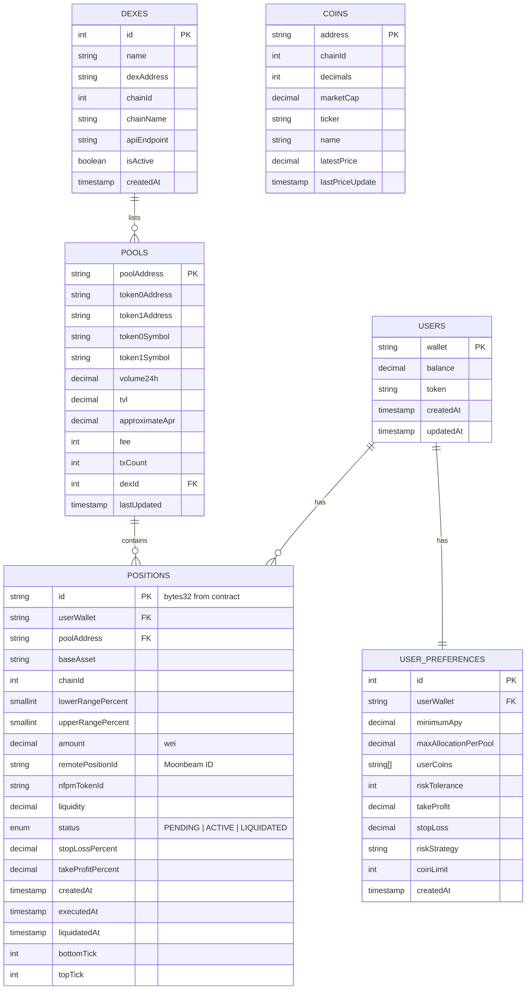

# LiquiDOT Backend - Product Requirements Document (PRD)

**Version:** 1.0.0  
**Date:** November 11, 2025  
**Status:** Development  
**Owner:** LiquiDOT Team

---

## 📋 Executive Summary

LiquiDOT Backend is a NestJS-based automation engine that manages cross-chain liquidity positions across Polkadot parachains. It provides intelligent investment decision-making, real-time position monitoring, automated stop-loss execution, and seamless integration with AssetHub and Moonbeam smart contracts.

### Core Value Proposition
- **Automated LP Management**: Set strategies once, let the system handle execution
- **Cross-Chain Orchestration**: Seamlessly manage positions across Asset Hub and Moonbeam
- **Risk Management**: Automated stop-loss and take-profit triggers
- **Real-Time Analytics**: Continuous pool data aggregation and analysis

---

## 🎯 Product Goals

### Primary Objectives
1. **Automate LP Lifecycle** - From decision to execution to liquidation
2. **Ensure Position Safety** - Monitor and protect user investments 24/7
3. **Optimize Capital Efficiency** - Smart allocation across high-yield pools
4. **Enable Cross-Chain DeFi** - Leverage Polkadot's XCM for seamless asset transfers

### Success Metrics
- Position execution success rate: >99%
- Stop-loss trigger latency: <60 seconds
- Pool data freshness: <10 minutes
- System uptime: >99.5%

---

## 🏗️ High-Level Architecture

### System Components Diagram

```mermaid
graph TB
    subgraph "External Systems"
        Frontend["Frontend UI<br/>(Next.js + Wagmi)"]
        AssetHub["Asset Hub<br/>(Vault Contract)"]
        Moonbeam["Moonbeam<br/>(XCM Proxy Contract)"]
        AlgebraAPI["Algebra Subgraph<br/>(Pool Data)"]
    end

    subgraph "Backend Core<br/>(NestJS Application)"
        direction TB
        API["REST API Layer<br/>• Health<br/>• Pools<br/>• Positions<br/>• Decisions"]
        
        subgraph "Business Logic"
            IDWorker["Investment Decision Worker<br/>• Strategy Engine<br/>• Pool Selection<br/>• Risk Scoring"]
            SLWorker["Stop-Loss Worker<br/>• Position Monitor<br/>• Range Validator<br/>• Liquidation Executor"]
            PoolAgg["Pool Aggregator<br/>• Data Fetcher<br/>• APR Calculator<br/>• TVL Analyzer"]
        end
        
        subgraph "Blockchain Integration"
            AssetHubSvc["Asset Hub Service<br/>• dispatchInvestment()<br/>• confirmExecution()<br/>• settleLiquidation()"]
            MoonbeamSvc["Moonbeam Service<br/>• executePendingInvestment()<br/>• liquidateSwapAndReturn()<br/>• isPositionOutOfRange()"]
            EventListener["Event Listener<br/>• InvestmentInitiated<br/>• PositionExecuted<br/>• LiquidationCompleted"]
        end
    end

    subgraph "Data Layer"
        PostgreSQL[("PostgreSQL<br/>• Users<br/>• Positions<br/>• Pools<br/>• Preferences")]
    end

    Frontend -->|HTTP/JSON| API
    API --> IDWorker
    API --> PoolAgg
    
    IDWorker -->|Read Pool Data| PostgreSQL
    IDWorker -->|Create Investment| AssetHubSvc
    
    SLWorker -->|Monitor| MoonbeamSvc
    SLWorker -->|Update Status| PostgreSQL
    
    PoolAgg -->|Fetch| AlgebraAPI
    PoolAgg -->|Store| PostgreSQL
    
    AssetHubSvc -->|Contract Calls| AssetHub
    MoonbeamSvc -->|Contract Calls| Moonbeam
    
    EventListener -->|Listen| AssetHub
    EventListener -->|Listen| Moonbeam
    EventListener -->|Update| PostgreSQL
    
    AssetHub -.->|XCM Transfer| Moonbeam
    Moonbeam -.->|XCM Return| AssetHub

    style Frontend fill:#4fc3f7,stroke:#0288d1,stroke-width:3px
    style AssetHub fill:#66bb6a,stroke:#388e3c,stroke-width:3px
    style Moonbeam fill:#64b5f6,stroke:#1976d2,stroke-width:3px
    style PostgreSQL fill:#ba68c8,stroke:#7b1fa2,stroke-width:3px
    style IDWorker fill:#ffa726,stroke:#f57c00,stroke-width:2px
    style SLWorker fill:#ef5350,stroke:#c62828,stroke-width:2px
    style PoolAgg fill:#66bb6a,stroke:#2e7d32,stroke-width:2px
```



---

## 🔄 Data Flow Diagrams

### Investment Flow (User → Position Creation)


### Stop-Loss Flow (Position Monitoring → Liquidation)

```mermaid
sequenceDiagram
    participant SLWorker as Stop-Loss<br/>Worker
    participant DB as PostgreSQL
    participant Moonbeam as Moonbeam<br/>Service
    participant Proxy as XCM Proxy<br/>Contract
    participant AssetHub as Asset Hub<br/>Service
    participant Vault as AssetHub<br/>Vault Contract

    loop Every 60 seconds
        SLWorker->>DB: Load ACTIVE positions
        DB-->>SLWorker: positions[]
        
        loop For each position
            SLWorker->>Moonbeam: isPositionOutOfRange(positionId)
            Moonbeam->>Proxy: Contract call
            Proxy->>Proxy: Check current tick<br/>vs. bottomTick/topTick
            Proxy-->>Moonbeam: {outOfRange, currentPrice}
            Moonbeam-->>SLWorker: Position status
            
            alt Position OUT of range
                SLWorker->>SLWorker: ⚠️ TRIGGER LIQUIDATION
                SLWorker->>Moonbeam: liquidateSwapAndReturn()<br/>positionId, baseAsset, destination
                
                Moonbeam->>Proxy: Contract call
                Proxy->>Proxy: 1. Burn LP position (NFPM)
                Proxy->>Proxy: 2. Swap token0/token1 → baseAsset
                Proxy->>Proxy: 3. Send assets via XCM
                Proxy-->>Moonbeam: tx receipt + totalReturned
                
                Moonbeam->>DB: Update position (LIQUIDATED)
                
                Note over AssetHub: Assets arrive via XCM
                AssetHub->>Vault: settleLiquidation()<br/>positionId, receivedAmount
                Vault->>Vault: Credit user balance
                AssetHub->>DB: Update final amounts
                
                SLWorker->>User: 🔔 Position liquidated notification
            else Position still in range
                SLWorker->>SLWorker: ✅ Continue monitoring
            end
        end
    end
```



---

## 📊 Database Schema



---

## 🔗 XCM Message Construction

### Overview

The LiquiDOT backend is responsible for **constructing XCM messages** before passing them to smart contracts. The contracts (`AssetHubVault.sol` and `XCMProxy.sol`) use precompiled XCM interfaces but expect the backend to provide:

1. **Destination** - SCALE-encoded `MultiLocation` for the target chain
2. **XCM Message** - SCALE-encoded XCM program (instructions like `WithdrawAsset`, `BuyExecution`, `DepositAsset`, `Transact`)

### XCM Library Selection: ParaSpell XCM SDK

We use **ParaSpell XCM SDK** with **Polkadot-API (PAPI)** as it is:
- The **first and only XCM SDK** to support both PolkadotJS and Polkadot-API
- Production-ready with extensive parachain coverage
- Provides a **builder pattern** for intuitive XCM construction
- Supports both Asset Hub and Moonbeam chains

```bash
# Install dependencies
pnpm add @paraspell/sdk polkadot-api
```

### XCM Builder Service Architecture

```mermaid
graph LR
    subgraph "Backend Services"
        InvWorker["Investment<br/>Decision Worker"]
        SLWorker["Stop-Loss<br/>Worker"]
    end

    subgraph "XCM Builder Service"
        Builder["ParaSpell<br/>SDK Builder"]
        Encoder["SCALE<br/>Encoder"]
        Validator["Message<br/>Validator"]
    end

    subgraph "Contract Services"
        AssetHubSvc["Asset Hub<br/>Service"]
        MoonbeamSvc["Moonbeam<br/>Service"]
    end

    subgraph "Contracts"
        Vault["AssetHubVault<br/>(IXcm precompile)"]
        Proxy["XCMProxy<br/>(IXTokens precompile)"]
    end

    InvWorker -->|Build Investment XCM| Builder
    SLWorker -->|Build Return XCM| Builder
    
    Builder --> Encoder
    Encoder --> Validator
    Validator -->|destination bytes| AssetHubSvc
    Validator -->|xcmMessage bytes| AssetHubSvc
    Validator -->|destination bytes| MoonbeamSvc
    
    AssetHubSvc -->|dispatchInvestment(...)| Vault
    MoonbeamSvc -->|liquidateSwapAndReturn(...)| Proxy
    
    Vault -->|IXcm.send()| XCM["XCM Transport"]
    Proxy -->|IXTokens.transfer()| XCM

    style Builder fill:#66bb6a,stroke:#388e3c,stroke-width:2px
    style Encoder fill:#ffa726,stroke:#f57c00,stroke-width:2px
```

### XCM Message Types

#### 1. Investment XCM (Asset Hub → Moonbeam)

When `dispatchInvestment()` is called, the backend must construct:

```typescript
import { Builder } from '@paraspell/sdk';

// Build XCM for Asset Hub → Moonbeam transfer with Transact
async function buildInvestmentXcm(params: {
  amount: bigint;
  xcmProxyAddress: string;   // Moonbeam XCMProxy contract
  moonbeamParaId: number;    // 2004 for Moonbeam
}): Promise<{ destination: Uint8Array; xcmMessage: Uint8Array }> {
  
  // Use ParaSpell builder to construct the XCM
  const builder = await Builder()
    .from('AssetHubPolkadot')  
    .to('Moonbeam')
    .currency({ symbol: 'DOT', amount: params.amount })
    .address(params.xcmProxyAddress)  // Destination account on Moonbeam
    .build();
  
  // Extract the raw XCM bytes for contract submission
  // The contract's IXcm.send(destination, message) expects these
  return {
    destination: builder.destination,
    xcmMessage: builder.message,
  };
}
```

#### 2. Liquidation Return XCM (Moonbeam → Asset Hub)

When `liquidateSwapAndReturn()` is called, the XCMProxy uses `IXTokens` precompile which handles XCM internally, but we need to construct the destination:

```typescript
import { Builder, Version } from '@paraspell/sdk';

// Build destination for XTokens return transfer
async function buildReturnDestination(params: {
  userAddress: string;    // User's Asset Hub address
  assetHubParaId: number; // 1000 for Asset Hub
}): Promise<Uint8Array> {
  
  // Construct MultiLocation for Asset Hub destination
  const builder = await Builder()
    .from('Moonbeam')
    .to('AssetHubPolkadot')
    .address(params.userAddress)
    .xcmVersion(Version.V4)  // Use XCM V4 for latest features
    .build();
  
  return builder.destination;
}
```

### XCM Message Structure

The XCM message for investment follows this pattern:

```
XCM Program:
  1. WithdrawAsset { asset: DOT, amount }
  2. BuyExecution { fees: DOT, weight_limit: Unlimited }
  3. DepositAsset { assets: All, beneficiary: XCMProxy }
  4. Transact { 
       origin_type: SovereignAccount,
       call: receiveAssets(user, positionId, poolId, amount, ranges)
     }
  5. ExpectTransactStatus { status: Success }
  6. RefundSurplus
  7. DepositAsset { assets: All, beneficiary: Origin }
```

### ParaSpell SDK Integration

```typescript
// src/modules/blockchain/services/xcm-builder.service.ts

import { Injectable, Logger } from '@nestjs/common';
import { Builder, Version } from '@paraspell/sdk';

export interface XcmInvestmentParams {
  amount: bigint;
  moonbeamProxyAddress: string;
  assetHubVaultAddress: string;
  user: string;
  poolId: string;
  chainId: number;
  lowerRangePercent: number;
  upperRangePercent: number;
}

export interface XcmReturnParams {
  userAddress: string;
  amount: bigint;
}

@Injectable()
export class XcmBuilderService {
  private readonly logger = new Logger(XcmBuilderService.name);

  /**
   * Build XCM message for Asset Hub → Moonbeam investment
   */
  async buildInvestmentXcm(params: XcmInvestmentParams): Promise<{
    destination: Uint8Array;
    xcmMessage: Uint8Array;
  }> {
    this.logger.log(`Building investment XCM for ${params.amount} to ${params.poolId}`);
    
    try {
      // ParaSpell handles the complex XCM construction
      const builder = await Builder()
        .from('AssetHubPolkadot')
        .to('Moonbeam')
        .currency({ 
          symbol: 'DOT', 
          amount: params.amount.toString() 
        })
        .address(params.moonbeamProxyAddress)
        .xcmVersion(Version.V4)
        .build();

      return {
        destination: new Uint8Array(builder.destination),
        xcmMessage: new Uint8Array(builder.message),
      };
    } catch (error) {
      this.logger.error(`Failed to build investment XCM: ${error.message}`);
      throw error;
    }
  }

  /**
   * Build XCM destination for Moonbeam → Asset Hub return
   */
  async buildReturnDestination(params: XcmReturnParams): Promise<Uint8Array> {
    this.logger.log(`Building return destination for ${params.userAddress}`);
    
    try {
      const builder = await Builder()
        .from('Moonbeam')
        .to('AssetHubPolkadot')
        .currency({ 
          symbol: 'DOT', 
          amount: params.amount.toString() 
        })
        .address(params.userAddress)
        .build();

      return new Uint8Array(builder.destination);
    } catch (error) {
      this.logger.error(`Failed to build return destination: ${error.message}`);
      throw error;
    }
  }

  /**
   * Dry run XCM to verify it will succeed before execution
   */
  async dryRunXcm(params: XcmInvestmentParams): Promise<{
    success: boolean;
    estimatedFees: string;
    error?: string;
  }> {
    try {
      const result = await Builder()
        .from('AssetHubPolkadot')
        .to('Moonbeam')
        .currency({ 
          symbol: 'DOT', 
          amount: params.amount.toString() 
        })
        .address(params.moonbeamProxyAddress)
        .senderAddress(params.user)
        .dryRun();

      return {
        success: result.success,
        estimatedFees: result.fees?.toString() ?? '0',
        error: result.error,
      };
    } catch (error) {
      return {
        success: false,
        estimatedFees: '0',
        error: error.message,
      };
    }
  }

  /**
   * Disconnect API connections when service is destroyed
   */
  async onModuleDestroy() {
    this.logger.log('Disconnecting XCM builder connections');
    // ParaSpell handles cleanup internally
  }
}
```

### Contract Integration Points

| Contract Function | XCM Requirement | Backend Responsibility |
|-------------------|-----------------|------------------------|
| `dispatchInvestment()` | Takes `destination` + `preBuiltXcmMessage` | Build complete XCM program via ParaSpell |
| `liquidateSwapAndReturn()` | Takes `destination` for XTokens | Build MultiLocation for Asset Hub |
| `receiveAssets()` | Called via XCM Transact | Encode call data in XCM message |

### Environment Configuration

```bash
# XCM Configuration
XCM_VERSION=4
MOONBEAM_PARA_ID=2004
ASSET_HUB_PARA_ID=1000

# ParaSpell SDK can use custom endpoints
ASSET_HUB_WS_URL=wss://polkadot-asset-hub-rpc.polkadot.io
MOONBEAM_WS_URL=wss://wss.api.moonbeam.network

# Test Mode (skip real XCM in development)
XCM_TEST_MODE=true
```

---

## 🎯 Feature Requirements

### 1. Investment Decision Worker

**Purpose:** Analyze pools and generate investment recommendations

**Requirements:**
- **FR1.1** Fetch pool data from database
- **FR1.2** Filter pools by user preferences (min APR, allowed coins)
- **FR1.3** Apply risk strategy (highest APR, highest TVL, balanced)
- **FR1.4** Calculate optimal allocation proportions
- **FR1.5** **Build XCM messages via XcmBuilderService**
- **FR1.6** Execute investments via Asset Hub contract
- **FR1.7** Run automatically every hour (configurable)

**Contract Integration:**
```typescript
// Calls AssetHubVault.dispatchInvestment()
interface DispatchInvestmentParams {
  user: string;
  chainId: number;
  poolId: string;
  baseAsset: string;
  amount: bigint;
  lowerRangePercent: number; // e.g., -5 for -5%
  upperRangePercent: number; // e.g., +10 for +10%
  destination: Uint8Array;  // Built by XcmBuilderService
  xcmMessage: Uint8Array;   // Built by XcmBuilderService
}
```

### 2. Stop-Loss Worker

**Purpose:** Monitor positions and trigger liquidations

**Requirements:**
- **FR2.1** Load all ACTIVE positions from database
- **FR2.2** Check if position is out of range via Moonbeam contract
- **FR2.3** **Build XCM return destination via XcmBuilderService**
- **FR2.4** Trigger liquidation when stop-loss condition met
- **FR2.5** Update position status in database
- **FR2.6** Run every 60 seconds (configurable)

**Contract Integration:**
```typescript
// 1. Check position health
const [outOfRange, currentPrice] = await xcmProxy.isPositionOutOfRange(positionId);

// 2. If triggered, build XCM destination and liquidate
if (outOfRange) {
  // Build destination for return transfer
  const destination = await xcmBuilderService.buildReturnDestination({
    userAddress: position.user,
    amount: estimatedReturnAmount,
  });

  await xcmProxy.liquidateSwapAndReturn({
    positionId,
    baseAsset,
    destination, // Built by XcmBuilderService
    minAmountOut0,
    minAmountOut1,
    limitSqrtPrice,
    assetHubPositionId
  });
  
  // 3. Settle on AssetHub after XCM transfer
  await assetHubVault.settleLiquidation(positionId, receivedAmount);
}
```

### 3. Pool Data Aggregator

**Purpose:** Keep pool analytics up-to-date

**Requirements:**
- **FR3.1** Fetch pool data from Algebra subgraph
- **FR3.2** Calculate approximate APR
- **FR3.3** Store/update pool records in database
- **FR3.4** Run every 10 minutes (configurable)

**Data Source:**
```graphql
query {
  pools(first: 100, orderBy: totalValueLockedUSD, orderDirection: desc) {
    id
    token0 { id, symbol, name }
    token1 { id, symbol, name }
    fee
    totalValueLockedUSD
    volumeUSD
    txCount
  }
}
```

### 4. Event Listener Service

**Purpose:** React to on-chain events

**Requirements:**
- **FR4.1** Listen to AssetHub `InvestmentInitiated` events
- **FR4.2** Listen to Moonbeam `PositionExecuted` events
- **FR4.3** Listen to Moonbeam `LiquidationCompleted` events
- **FR4.4** Update database on event receipt
- **FR4.5** Trigger confirmExecution when Moonbeam completes

**Event Handling:**
```typescript
// AssetHub events
vault.on('InvestmentInitiated', (positionId, user, chainId, poolId, amount) => {
  // Create PENDING position in DB
});

// Moonbeam events
proxy.on('PositionExecuted', (assetHubPositionId, localPositionId, nfpmTokenId, liquidity) => {
  // Call vault.confirmExecution()
  // Update position to ACTIVE
});

proxy.on('LiquidationCompleted', (positionId, assetHubPositionId, user, baseAsset, totalReturned) => {
  // Update position to LIQUIDATED
});
```

---

## 🔐 Security Requirements

### Authentication & Authorization
- **SR1** Operator private key stored in environment variables (never committed)
- **SR2** Contract addresses validated on startup
- **SR3** Rate limiting on API endpoints (100 req/min per IP)

### Contract Interaction Safety
- **SR4** Test mode flag for local development (no real XCM calls)
- **SR5** Gas estimation before transaction submission
- **SR6** Transaction retry logic with exponential backoff
- **SR7** Event log validation (signature verification)

### Data Integrity
- **SR8** Position state transitions validated (PENDING → ACTIVE → LIQUIDATED)
- **SR9** Amount calculations use BigInt to prevent overflow
- **SR10** Database transactions for atomic updates

---

## ⚡ Performance Requirements

| Metric | Target | Critical Threshold |
|--------|--------|-------------------|
| API Response Time | <200ms | <500ms |
| Stop-Loss Detection | <60s | <120s |
| Investment Execution | <5min | <10min |
| Pool Data Freshness | <10min | <30min |
| Database Query Time | <50ms | <200ms |
| Event Processing Delay | <30s | <60s |

---

## 🚀 Deployment Requirements

### Dependencies

```json
{
  "dependencies": {
    "@nestjs/common": "^10.0.0",
    "@nestjs/config": "^3.1.1",
    "@nestjs/core": "^10.0.0",
    "@nestjs/schedule": "^4.0.0",
    "@nestjs/typeorm": "^10.0.1",
    "typeorm": "^0.3.17",
    "pg": "^8.11.3",
    "ethers": "^6.9.0",
    
    "@paraspell/sdk": "^11.0.0",
    "polkadot-api": "^1.0.0"
  }
}
```

### Environment Variables
```bash
# Database
DATABASE_HOST=localhost
DATABASE_PORT=5432
DATABASE_NAME=liquidot
DATABASE_USER=liquidot
DATABASE_PASSWORD=***

# Blockchain RPC
ASSET_HUB_RPC_URL=wss://polkadot-asset-hub-rpc.polkadot.io
MOONBEAM_RPC_URL=https://rpc.api.moonbeam.network

# Alternative WebSocket endpoints (for XCM SDK)
ASSET_HUB_WS_URL=wss://polkadot-asset-hub-rpc.polkadot.io
MOONBEAM_WS_URL=wss://wss.api.moonbeam.network

# Contracts
ASSET_HUB_VAULT_ADDRESS=0x...
XCM_PROXY_ADDRESS=0x...

# Operator
OPERATOR_PRIVATE_KEY=0x...

# Workers
ENABLE_INVESTMENT_WORKER=true
ENABLE_STOP_LOSS_WORKER=true
ENABLE_POOL_AGGREGATOR=true

# XCM Configuration
XCM_VERSION=4
MOONBEAM_PARA_ID=2004
ASSET_HUB_PARA_ID=1000
XCM_TEST_MODE=false

# API
PORT=3001
NODE_ENV=production
CORS_ORIGIN=https://app.liquidot.io
```

### Infrastructure
- **CPU:** 2 vCPU minimum
- **Memory:** 2GB minimum
- **Storage:** 20GB for database
- **Network:** Outbound HTTPS + WebSocket access

---

## 📈 Monitoring & Observability

### Key Metrics
1. **Worker Health**
   - Investment Decision Worker execution count
   - Stop-Loss Worker position checks per minute
   - Pool Aggregator successful fetches

2. **Position Metrics**
   - Active positions count
   - Average position lifetime
   - Liquidation success rate

3. **System Health**
   - API uptime percentage
   - Database connection pool usage
   - RPC call success rate

### Logging
```typescript
// Structured logging
logger.log({
  service: 'stop-loss-worker',
  action: 'liquidation_triggered',
  positionId: '0x123...',
  user: '0xabc...',
  reason: 'out_of_range',
  currentPrice: 1234,
  bottomTick: -1000,
  topTick: 1000
});
```

---

## 🧪 Testing Strategy

### Unit Tests
- Service logic (investment decisions, APR calculations)
- Database repository methods
- Utility functions (tick calculations)
- **XCM Builder Service mocking**

### XCM Testing
- **Mock Mode**: `XCM_TEST_MODE=true` returns deterministic mock bytes
- **Dry Run**: Use `dryRunXcm()` to validate messages before execution
- **Local Testing**: Use ParaSpell's `development` mode with local endpoints
- **Zombienet**: Spawn local Asset Hub + Moonbeam for E2E XCM tests

```typescript
// Example: Testing XCM Builder with mock mode
describe('XcmBuilderService', () => {
  beforeEach(() => {
    process.env.XCM_TEST_MODE = 'true';
  });

  it('should build mock investment XCM', async () => {
    const result = await xcmBuilder.buildInvestmentXcm({
      amount: BigInt('1000000000000'),
      moonbeamProxyAddress: '0x1234...',
      // ...
    });
    
    expect(result.destination).toBeDefined();
    expect(result.xcmMessage).toBeDefined();
    expect(result.destination.length).toBeGreaterThan(0);
  });
});
```

### Integration Tests
- Contract interaction mocks
- Database operations
- Event listener processing
- **XCM message encoding verification**

### E2E Tests
- Full investment flow (deposit → XCM → execution → liquidation)
- Multi-user scenarios
- Error handling and recovery
- **Cross-chain XCM verification with Zombienet**

---

## 📅 Development Milestones

### Phase 1: Core Infrastructure (Week 1-2)
- [x] NestJS project setup
- [x] Database schema & entities
- [x] Basic API endpoints
- [x] Contract service integration
- [x] XCM Builder Service with ParaSpell SDK

### Phase 2: Workers Implementation (Week 3-4)
- [ ] Investment Decision Worker (with XCM building)
- [ ] Stop-Loss Worker (with XCM return destinations)
- [ ] Pool Aggregator
- [ ] Event Listener

### Phase 3: Testing & Hardening (Week 5-6)
- [ ] Unit test coverage >80%
- [ ] Integration tests
- [ ] XCM message validation tests
- [ ] Contract interaction testing
- [ ] Performance optimization

### Phase 4: Deployment & Monitoring (Week 7-8)
- [ ] Docker containerization
- [ ] AWS ECS deployment
- [ ] CloudWatch monitoring
- [ ] Documentation finalization

---

## 📚 API Specification

### Pools Endpoint
```
GET /api/pools
Query: ?minApr=10&minTvl=1000&limit=50
Response: {
  success: true,
  data: {
    pools: Pool[],
    count: number
  }
}
```

### Positions Endpoint
```
GET /api/positions/:userAddress
Query: ?status=ACTIVE&page=0&limit=20
Response: {
  success: true,
  data: {
    positions: Position[],
    total: number,
    page: number,
    limit: number
  }
}
```

### Investment Decisions Endpoint
```
POST /api/investment/decisions
Body: UserPreference
Response: {
  success: true,
  timestamp: string,
  decisions: InvestmentDecision[]
}
```

---

## 🔄 Future Enhancements

### Phase 2 Features
1. **Multi-Chain Support** - Add Hydration, Acala parachains
2. **Advanced Strategies** - ML-based pool selection
3. **Position Rebalancing** - Automatic range adjustment
4. **WebSocket API** - Real-time position updates
5. **User Notifications** - Email/Telegram alerts

### Phase 3 Features
1. **zkProof Verification** - Verify investment decisions on-chain
2. **Position NFTs** - ERC-721 position tokenization
3. **Governance Integration** - DAO decision-making
4. **Tax Reporting** - Generate transaction reports

---

## ✅ Acceptance Criteria

**The backend is production-ready when:**

1. ✅ All API endpoints return expected responses
2. ✅ Investment Decision Worker creates valid positions
3. ✅ Stop-Loss Worker liquidates out-of-range positions <60s
4. ✅ Pool Aggregator updates data every 10 minutes
5. ✅ Event Listener processes all contract events
6. ✅ Database handles 1000+ concurrent positions
7. ✅ System uptime >99.5% over 7 days
8. ✅ All critical paths have error handling
9. ✅ Documentation complete and accurate
10. ✅ Docker deployment successful

---

## 📞 Support & Maintenance

**On-Call Rotation:** 24/7 coverage during production launch  
**Incident Response Time:** <15 minutes for P0, <2 hours for P1  
**Backup Frequency:** Daily database backups, 30-day retention  
**Update Cadence:** Weekly deployments, monthly security patches

---

**Document Status:** ✅ Approved for Development  
**Last Updated:** November 11, 2025  
**Next Review:** December 11, 2025

## 🔄 Data Aggregation Strategy (The Graph)

We utilize a dedicated Subgraph on The Graph (Hosted Service) to index Algebra Integral pool data on the Moonbase Alpha testnet. This replaces the direct RPC strategy to provide historical data and efficient querying.

### 1. Pool Discovery & Indexing
The Subgraph listens for `Pool` events emitted by the `AlgebraFactory` and indexes all created pools.

**Entities Indexed:**
- `Pool`: Address, token pair, fee, current tick, liquidity.
- `Token`: Symbol, name, decimals.
- `PoolDayData`: Daily volume, fees, and TVL snapshots for APR calculation.

### 2. Data Querying
The Backend `PoolScannerService` queries the Subgraph via GraphQL to fetch:
- Top pools by TVL.
- 24h Volume and Fees (derived from `PoolDayData`).
- Current Tick and Liquidity.

**Query Endpoint:**
- Configured via `ALGEBRA_SUBGRAPH_URL` environment variable.

**Update Frequency:**
- The backend syncs data every 5 minutes using a scheduled task.
