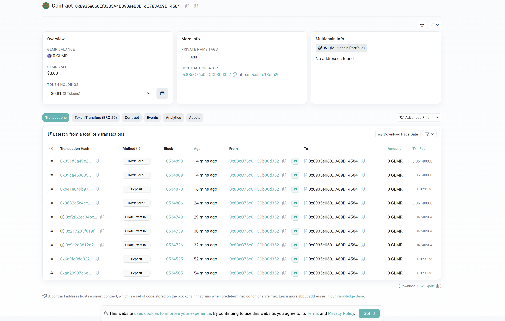
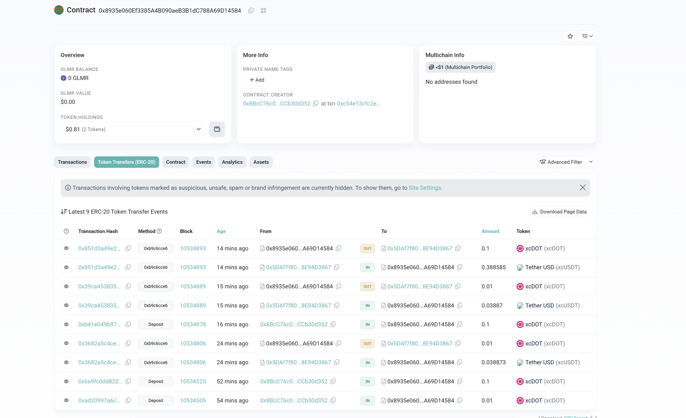

# CrossLiquidity Protocol 🌊

A decentralized, cross-chain liquidity management protocol for Polkadot parachains. Our solution enables efficient liquidity management through smart on-chain optimization algorithms and cross-chain asset transfer via XCM.

[](https://youtu.be/9bX0Up0pLww)
[Click here to watch the demo](https://youtu.be/9bX0Up0pLww)

## Project Overview

CrossLiquidity Protocol combines blockchain technology with advanced optimization algorithms to automatically manage liquidity across Polkadot parachains. The system enables users to:

- Automatically manage liquidity positions across multiple pools
- Use data-driven algorithms to maximize yield and minimize risk
- Seamlessly transfer assets between parachains using XCM messaging
- Monitor and adjust strategies through an intuitive user interface

## 📸 Screenshots


*Frontend interface showing the Pool Manager with coin selection, APR settings, and risk parameters*


*Detailed pool interface with strategy parameters*


*Cross-chain asset transfer interface*

## 🎬 Project Walkthrough

* Smart Contract walkthrough: https://youtu.be/uR1Q-MbCqyc
* Platform walthrough: https://youtu.be/kveBw8GVIVk 

In this walkthrough video, we explain:
- Project architecture and design decisions
- Smart contract implementation details
- Frontend user interface
- Optimization algorithms
- XCM integration for cross-chain functionality
- Installation and usage instructions
- Demo of the complete system

## 🏗️ Repository Structure

```
PolkadotHack2025/
├── Backend/                  # Backend services and contract interaction
│   ├── interact-with-contract.js  # Contract interaction utilities
│   ├── liquidity-swapper.js       # Advanced swapping functionality
│   ├── example.js                 # Example usage
│   └── package.json               # Dependencies
├── SmartContracts/           # Solidity smart contracts
│   ├── contracts/            # Contract source code
│   │   ├── LiquidityProvider.sol      # Main liquidity provider contract
│   │   ├── LiquidityRouter.sol        # Router for contract interaction
│   │   └── XCMProxy.sol               # XCM proxy for cross-chain messaging
│   └── scripts/              # Deployment and testing scripts
└── Frontend/                 # React-based user interface
    ├── src/                  # Frontend source code
    └── public/               # Static assets
```

## ✨ Features

- **Automated Liquidity Management**: Algorithmic decision-making for optimal liquidity provision
- **Cross-chain Asset Transfer**: Seamless movement of assets between parachains using XCM
- **Multi-pool Strategy**: Distribute liquidity across multiple pools based on risk-reward profiles
- **Automatic Rebalancing**: Regular readjustment of positions based on market conditions
- **User-defined Parameters**: Customizable risk levels, yield targets, and strategy options
- **Real-time Monitoring**: Track performance and adjust strategies as needed

## 🚀 Getting Started

### Prerequisites

- Node.js v16+
- Yarn or npm
- Polkadot{.js} browser extension
- MetaMask or similar wallet for EVM interactions

### Installation

1. Clone the repository:
```bash
git clone https://github.com/yourusername/PolkadotHack2025.git
cd PolkadotHack2025
```

2. Install backend dependencies:
```bash
cd Backend
npm install
```

3. Configure backend environment variables:
```bash
# Copy the example .env file
cp .env.example .env

# Edit the .env file with your own values
nano .env  # or use any text editor
```

4. Update your `.env` file with the following information:
   - `PROVIDER_CONTRACT_ADDRESS`: Your deployed LiquidityProvider contract address
   - `ROUTER_CONTRACT_ADDRESS`: Your deployed LiquidityRouter contract address
   - `PRIVATE_KEY`: Your wallet's private key (keep this secure!)
   - `TOKEN0_ADDRESS`, `TOKEN1_ADDRESS`: Token addresses you want to interact with
   - `POOL_ADDRESS`: Liquidity pool address you want to interact with

5. Setup frontend:
```bash
cd Frontend
npm install
```

### Running the Backend

1. Run the example script to test contract interaction:
```bash
cd Backend
npm start
```

### Running the Frontend

1. Start the frontend development server:
```bash
cd Frontend
pnpm dev
```

2. Access the frontend at `http://localhost:3000`

## 💻 Technologies Used

- **Blockchain**: Polkadot, Moonbeam, XCM protocol
- **Smart Contracts**: Solidity, Hardhat
- **Frontend**: React, ethers.js, Polkadot{.js} API
- **Backend**: Node.js, ethers.js
- **Algorithms**: Advanced computational strategies for yield optimization

## 🔗 XCM Integration

Our project leverages XCM (Cross-Consensus Message Format) to enable seamless communication between parachains in the Polkadot ecosystem. The LiquidityProvider contract can:

1. Transfer assets from Asset Hub to Moonbeam
2. Execute operations on Moonbeam via XCM proxy
3. Manage liquidity across multiple parachains without requiring manual transfers

This integration demonstrates a practical application of Polkadot's cross-chain messaging capabilities for DeFi use cases.

## 🛠️ Technical Implementation

### Smart Contracts

The core of our system consists of three main contracts:

1. **LiquidityProvider**: Manages assets on Asset Hub and communicates with Moonbeam via XCM
   - Deployed on [Asset Hub Westend](https://assethub-westend.subscan.io/account/0x1a5ccde94578f6e0301f36b2b86ebf08a777d3ad)
2. **LiquidityRouter**: Provides batch operations and utility functions for easier interaction
3. **XCMProxy**: Receives instructions on Moonbeam and executes operations on DEXes
   - Deployed on [Moonbeam](https://moonscan.io/address/0x8935e060ef3385a4b090aeb3b1dc788a69d14584)

### Backend Services

Our backend provides an easy-to-use interface for interacting with the smart contracts:

1. **Contract Interaction**: Utilities for calling contract functions
2. **Strategy Execution**: Implementation of optimization strategies
3. **Data Processing**: Analysis of on-chain data for strategy optimization

### Frontend Interface

The user interface allows non-technical users to:

1. Connect their wallet
2. Select investment strategies
3. Monitor performance
4. Adjust parameters as needed

## 🚧 Development Challenges and Solutions

During the development of CrossLiquidity Protocol, we encountered several significant challenges that required creative solutions:

### DeFi Data Access Challenges

- **Limited DEX APIs**: We faced difficulties obtaining data from DEXes like Hydration, StellaSwap, and others due to lack of accessible APIs or documentation.
- **Web Scraping Limitations**: Attempted web scraping for data extraction was ineffective due to anti-scraping protections and dynamic content rendering.
- **Solution**: We implemented a hybrid approach using on-chain event listening combined with direct contract queries to gather essential pool data. This required more complex data processing but provided more reliable results.

### Smart Contract Deployment Issues

- **Gas Limitations**: We repeatedly hit gas limits when deploying our initial monolithic contract design to Moonbeam.
- **Contract Size Constraints**: The complex functionality required for cross-chain interactions resulted in contract sizes exceeding deployment limits.
- **Solution**: We refactored our architecture into three separate contracts (Provider, Router, Proxy) with clear separation of concerns. This modular approach not only resolved deployment issues but also improved contract maintainability and security.

### Cross-Chain Integration Obstacles

- **Testnet Connectivity**: We could not directly access the Moonbeam chain from the Westend testnet due to networking restrictions.
- **XCM Configuration Complexity**: Initial XCM message formats were incorrectly formatted, resulting in failed cross-chain transactions.
- **Solution**: We implemented a more robust XCM message structure with detailed error handling and fallback mechanisms. Additionally, we used relayers to bridge the communication gap between testnets.

These challenges ultimately led to a more robust and efficient system architecture, proving that obstacles in development can drive innovation and better design decisions.

## 📜 License

This project is licensed under the MIT License - see the [LICENSE](LICENSE) file for details.

## 🙏 Acknowledgements

- Polkadot and EasyA Hackathon organizers for the opportunity
