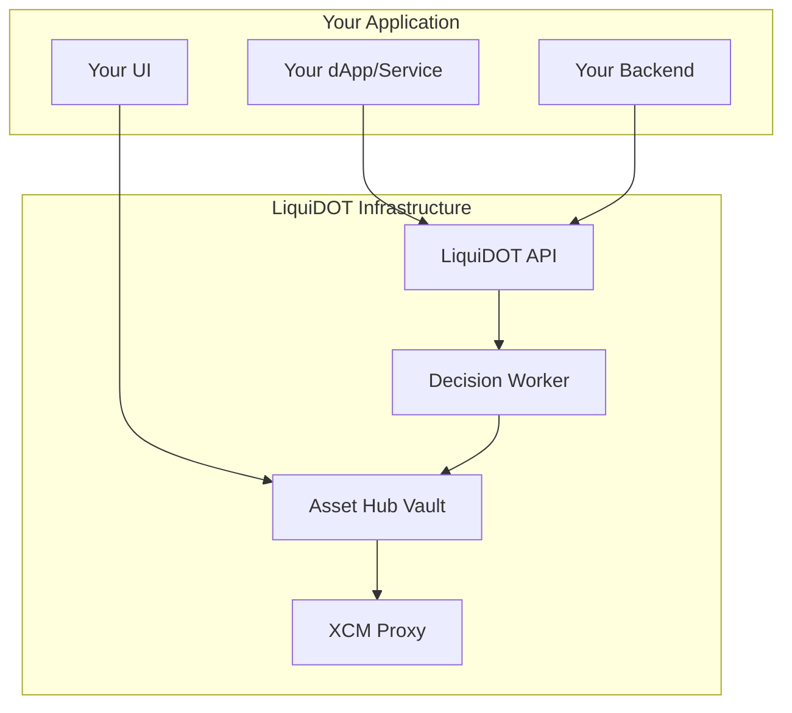

# 🔗 Integration Guide

> Complete guide for developers integrating with LiquiDOT's cross-chain liquidity management

---

## 🎯 Overview

LiquiDOT provides multiple integration points for developers, protocols, and applications wanting to leverage automated cross-chain liquidity management:

- **Smart Contract Integration** - Direct contract interactions
- **API Integration** - Backend service integration  
- **Widget Integration** - Embeddable UI components
- **Webhook Integration** - Real-time event notifications

---

## 🏗️ Architecture Understanding

### Core Components



### Integration Patterns

#### **1. Direct Contract Integration**
Your smart contracts interact directly with LiquiDOT contracts

#### **2. API Mediated Integration**  
Your backend calls LiquiDOT APIs for user operations

#### **3. Widget Integration**
Embed LiquiDOT UI components in your application

#### **4. Event-Driven Integration**
Receive real-time updates via webhooks

---

## 🔧 Smart Contract Integration

### Prerequisites

```bash
# Install LiquiDOT contract interfaces
npm install @liquidot/contracts

# Or clone the repository
git clone https://github.com/gabikreal1/LiquiDOT.git
```

### Contract Addresses

#### **Testnet Deployment**
```typescript
const CONTRACT_ADDRESSES = {
  assetHub: {
    vault: "0x...", // Asset Hub Vault contract
    chainId: 1000,  // Asset Hub chain ID
  },
  moonbeam: {
    proxy: "0x...", // XCM Proxy contract  
    chainId: 1284,  // Moonbeam chain ID
  }
};
```

#### **Mainnet Deployment** (Coming Soon)
*Addresses will be updated upon mainnet deployment*

### Basic Integration Example

#### **Depositing User Funds**
```solidity
// SPDX-License-Identifier: Apache-2.0
pragma solidity ^0.8.20;

import "@liquidot/contracts/interfaces/IAssetHubVault.sol";
import "@openzeppelin/contracts/token/ERC20/IERC20.sol";

contract YourProtocol {
    IAssetHubVault public immutable liquidotVault;
    
    constructor(address _liquidotVault) {
        liquidotVault = IAssetHubVault(_liquidotVault);
    }
    
    /**
     * @dev Deposit user funds into LiquiDOT for LP management
     */
    function depositToLiquiDOT(
        address token,
        uint256 amount,
        address user
    ) external {
        // Transfer tokens from user to this contract
        IERC20(token).transferFrom(user, address(this), amount);
        
        // Approve LiquiDOT vault
        IERC20(token).approve(address(liquidotVault), amount);
        
        // Deposit on behalf of user
        liquidotVault.deposit(token, amount);
        
        // Optional: Emit event for tracking
        emit DepositedToLiquiDOT(user, token, amount);
    }
}
```

#### **Checking User Balances**
```solidity
function getUserLiquiDOTBalance(
    address user,
    address token
) external view returns (uint256) {
    return liquidotVault.getUserBalance(user, token);
}

function getUserPositions(
    address user
) external view returns (IAssetHubVault.Position[] memory) {
    return liquidotVault.getUserPositions(user);
}
```

#### **Withdrawing Funds**
```solidity
function withdrawFromLiquiDOT(
    address token,
    uint256 amount,
    address recipient
) external {
    // Only allow user to withdraw their own funds
    require(msg.sender == recipient, "Unauthorized");
    
    // Withdraw from LiquiDOT vault
    liquidotVault.withdraw(token, amount);
    
    // Transfer to recipient
    IERC20(token).transfer(recipient, amount);
}
```

### Advanced Contract Integration

#### **Custom Investment Strategies**
```solidity
interface ILiquiDOTStrategy {
    function analyzeOpportunity(
        address user,
        address[] calldata tokens,
        uint256[] calldata amounts
    ) external view returns (
        address recommendedPool,
        int24 lowerRange,
        int24 upperRange,
        uint256 confidence
    );
}

contract CustomStrategyIntegration {
    ILiquiDOTStrategy public strategy;
    IAssetHubVault public vault;
    
    function createPositionWithCustomStrategy(
        address user,
        address[] calldata tokens,
        uint256[] calldata amounts
    ) external {
        // Get strategy recommendation
        (
            address pool,
            int24 lower,
            int24 upper,
            uint256 confidence
        ) = strategy.analyzeOpportunity(user, tokens, amounts);
        
        // Only proceed if confidence is high enough
        require(confidence >= 80, "Low confidence");
        
        // Execute investment through LiquiDOT
        // (Implementation depends on specific integration pattern)
    }
}
```

---

## 🌐 API Integration

### Authentication

#### **API Key Setup**
```bash
# Register for API access
curl -X POST https://api.liquidot.xyz/auth/register \
  -H "Content-Type: application/json" \
  -d '{
    "email": "dev@yourcompany.com",
    "project": "Your Project Name",
    "website": "https://yourproject.com"
  }'
```

#### **Authentication Headers**
```typescript
const apiClient = axios.create({
  baseURL: 'https://api.liquidot.xyz',
  headers: {
    'Authorization': `Bearer ${YOUR_API_KEY}`,
    'Content-Type': 'application/json'
  }
});
```

### Core API Endpoints

#### **User Management**
```typescript
// Get user portfolio summary
interface PortfolioSummary {
  totalValue: string;
  totalEarned: string;
  activePositions: number;
  availableBalance: Record<string, string>;
}

async function getUserPortfolio(userAddress: string): Promise<PortfolioSummary> {
  const response = await apiClient.get(`/users/${userAddress}/portfolio`);
  return response.data;
}

// Get user positions
interface Position {
  id: string;
  pool: string;
  chain: string;
  tokens: [string, string];
  value: string;
  entryPrice: string;
  currentPrice: string;
  range: [number, number];
  status: 'active' | 'inactive';
  createdAt: string;
}

async function getUserPositions(userAddress: string): Promise<Position[]> {
  const response = await apiClient.get(`/users/${userAddress}/positions`);
  return response.data;
}
```

#### **Investment Operations**
```typescript
// Create investment request
interface InvestmentRequest {
  user: string;
  baseAsset: string;
  amount: string;
  strategy: 'conservative' | 'moderate' | 'aggressive' | 'custom';
  customRange?: [number, number];
  stopLoss?: number;
  takeProfit?: number;
}

async function createInvestment(request: InvestmentRequest): Promise<string> {
  const response = await apiClient.post('/investments', request);
  return response.data.positionId;
}

// Liquidate position
async function liquidatePosition(
  positionId: string,
  partial: boolean = false,
  amount?: string
): Promise<void> {
  await apiClient.post(`/positions/${positionId}/liquidate`, {
    partial,
    amount
  });
}
```

#### **Market Data**
```typescript
// Get available pools
interface PoolInfo {
  id: string;
  chain: string;
  tokens: [string, string];
  tvl: string;
  volume24h: string;
  apr: string;
  fee: string;
}

async function getAvailablePools(): Promise<PoolInfo[]> {
  const response = await apiClient.get('/pools');
  return response.data;
}

// Get pool analytics
interface PoolAnalytics {
  pool: string;
  priceHistory: Array<{ timestamp: number; price: number }>;
  volumeHistory: Array<{ timestamp: number; volume: number }>;
  aprHistory: Array<{ timestamp: number; apr: number }>;
}

async function getPoolAnalytics(poolId: string): Promise<PoolAnalytics> {
  const response = await apiClient.get(`/pools/${poolId}/analytics`);
  return response.data;
}
```

### WebSocket Real-Time Updates

#### **Connection Setup**
```typescript
import io from 'socket.io-client';

const socket = io('wss://api.liquidot.xyz', {
  auth: {
    token: YOUR_API_KEY
  }
});

// Subscribe to user events
socket.emit('subscribe', {
  channels: [`user:${userAddress}`, 'pools', 'system']
});
```

#### **Event Handling**
```typescript
// Position updates
socket.on('position:updated', (data) => {
  console.log('Position updated:', data);
  // Update your UI with new position data
});

// Liquidation events
socket.on('position:liquidated', (data) => {
  console.log('Position liquidated:', data);
  // Notify user of liquidation
});

// System notifications
socket.on('system:maintenance', (data) => {
  console.log('System maintenance:', data);
  // Show maintenance notice to users
});
```

---

## 🎨 Widget Integration

### React Components

#### **Installation**
```bash
npm install @liquidot/react-widgets
```

#### **Portfolio Widget**
```typescript
import { LiquiDOTPortfolio } from '@liquidot/react-widgets';

function YourApp() {
  return (
    <div>
      <h1>Your DeFi Dashboard</h1>
      
      <LiquiDOTPortfolio
        userAddress={user.address}
        apiKey={process.env.LIQUIDOT_API_KEY}
        theme="dark" // or "light"
        onPositionClick={(position) => {
          // Handle position selection
          setSelectedPosition(position);
        }}
      />
    </div>
  );
}
```

#### **Investment Widget**
```typescript
import { LiquiDOTInvestment } from '@liquidot/react-widgets';

function InvestmentPage() {
  return (
    <LiquiDOTInvestment
      userAddress={user.address}
      availableTokens={['USDC', 'DOT', 'GLMR']}
      defaultStrategy="moderate"
      onInvestmentCreated={(positionId) => {
        // Handle successful investment
        toast.success(`Position ${positionId} created!`);
      }}
    />
  );
}
```

#### **Position Monitor Widget**
```typescript
import { LiquiDOTMonitor } from '@liquidot/react-widgets';

function MonitoringDashboard() {
  return (
    <LiquiDOTMonitor
      userAddress={user.address}
      refreshInterval={30000} // 30 seconds
      showAlerts={true}
      onAlert={(alert) => {
        // Handle position alerts
        if (alert.type === 'liquidation') {
          notify(`Position ${alert.positionId} was liquidated`);
        }
      }}
    />
  );
}
```

### Vanilla JavaScript Widget

#### **CDN Integration**
```html
<!DOCTYPE html>
<html>
<head>
  <script src="https://cdn.liquidot.xyz/widgets/latest/liquidot.min.js"></script>
  <link href="https://cdn.liquidot.xyz/widgets/latest/liquidot.css" rel="stylesheet">
</head>
<body>
  <div id="liquidot-portfolio"></div>
  
  <script>
    LiquiDOT.createPortfolioWidget({
      container: '#liquidot-portfolio',
      userAddress: '0x...',
      apiKey: 'your-api-key',
      theme: 'dark'
    });
  </script>
</body>
</html>
```

---

## 🔔 Webhook Integration

### Webhook Setup

#### **Register Webhook Endpoint**
```typescript
const webhookConfig = {
  url: 'https://yourapp.com/webhooks/liquidot',
  events: [
    'position.created',
    'position.liquidated',
    'position.rebalanced',
    'user.deposit',
    'user.withdrawal'
  ],
  secret: 'your-webhook-secret'
};

await apiClient.post('/webhooks', webhookConfig);
```

#### **Webhook Verification**
```typescript
import crypto from 'crypto';

function verifyWebhook(payload: string, signature: string, secret: string): boolean {
  const expectedSignature = crypto
    .createHmac('sha256', secret)
    .update(payload)
    .digest('hex');
  
  return `sha256=${expectedSignature}` === signature;
}

// Express.js webhook handler
app.post('/webhooks/liquidot', express.raw({type: 'application/json'}), (req, res) => {
  const signature = req.headers['x-liquidot-signature'] as string;
  const payload = req.body.toString();
  
  if (!verifyWebhook(payload, signature, process.env.WEBHOOK_SECRET)) {
    return res.status(400).send('Invalid signature');
  }
  
  const event = JSON.parse(payload);
  handleLiquiDOTEvent(event);
  
  res.status(200).send('OK');
});
```

### Event Types

#### **Position Events**
```typescript
interface PositionCreatedEvent {
  type: 'position.created';
  data: {
    positionId: string;
    user: string;
    pool: string;
    chain: string;
    amount: string;
    range: [number, number];
    timestamp: string;
  };
}

interface PositionLiquidatedEvent {
  type: 'position.liquidated';
  data: {
    positionId: string;
    user: string;
    reason: 'stop_loss' | 'take_profit' | 'manual' | 'emergency';
    finalValue: string;
    pnl: string;
    timestamp: string;
  };
}
```

#### **User Events**
```typescript
interface UserDepositEvent {
  type: 'user.deposit';
  data: {
    user: string;
    token: string;
    amount: string;
    txHash: string;
    timestamp: string;
  };
}

interface UserWithdrawalEvent {
  type: 'user.withdrawal';
  data: {
    user: string;
    token: string;
    amount: string;
    txHash: string;
    timestamp: string;
  };
}
```

---

## 📊 Analytics Integration

### Performance Tracking

#### **Track Investment Performance**
```typescript
interface PerformanceMetrics {
  totalInvested: string;
  currentValue: string;
  totalReturns: string;
  aprAnnualized: number;
  maxDrawdown: number;
  sharpeRatio: number;
  winRate: number;
}

async function getPerformanceMetrics(
  userAddress: string,
  timeframe: '7d' | '30d' | '90d' | '1y' | 'all'
): Promise<PerformanceMetrics> {
  const response = await apiClient.get(
    `/users/${userAddress}/performance?timeframe=${timeframe}`
  );
  return response.data;
}
```

#### **Custom Analytics Dashboard**
```typescript
import { Line, Bar } from 'react-chartjs-2';

function AnalyticsDashboard({ userAddress }: { userAddress: string }) {
  const [metrics, setMetrics] = useState<PerformanceMetrics>();
  const [chartData, setChartData] = useState();
  
  useEffect(() => {
    // Fetch performance data
    Promise.all([
      getPerformanceMetrics(userAddress, '30d'),
      getPortfolioHistory(userAddress, '30d')
    ]).then(([perf, history]) => {
      setMetrics(perf);
      setChartData(formatChartData(history));
    });
  }, [userAddress]);
  
  return (
    <div className="analytics-dashboard">
      <div className="metrics-grid">
        <MetricCard title="Total Returns" value={metrics?.totalReturns} />
        <MetricCard title="APR" value={`${metrics?.aprAnnualized}%`} />
        <MetricCard title="Win Rate" value={`${metrics?.winRate}%`} />
      </div>
      
      <div className="charts">
        <Line data={chartData} options={chartOptions} />
      </div>
    </div>
  );
}
```

---

## 🛡️ Security Best Practices

### API Security

#### **Rate Limiting**
```typescript
// Implement rate limiting on your side
const rateLimiter = rateLimit({
  windowMs: 15 * 60 * 1000, // 15 minutes
  max: 100, // limit each IP to 100 requests per windowMs
  message: 'Too many requests from this IP'
});

app.use('/api/liquidot', rateLimiter);
```

#### **API Key Management**
```typescript
// Store API keys securely
const apiKey = process.env.LIQUIDOT_API_KEY;

// Use different keys for different environments
const config = {
  development: {
    apiKey: process.env.LIQUIDOT_DEV_API_KEY,
    baseURL: 'https://api-dev.liquidot.xyz'
  },
  production: {
    apiKey: process.env.LIQUIDOT_PROD_API_KEY,
    baseURL: 'https://api.liquidot.xyz'
  }
};
```

### Smart Contract Security

#### **Access Control**
```solidity
contract SecureIntegration {
    address public owner;
    mapping(address => bool) public authorizedUsers;
    
    modifier onlyAuthorized() {
        require(
            msg.sender == owner || authorizedUsers[msg.sender],
            "Unauthorized"
        );
        _;
    }
    
    function depositToLiquiDOT(
        address token,
        uint256 amount
    ) external onlyAuthorized {
        // Secure deposit logic
    }
}
```

#### **Input Validation**
```solidity
function validateInvestmentParams(
    address token,
    uint256 amount,
    int24 lowerRange,
    int24 upperRange
) internal pure {
    require(token != address(0), "Invalid token");
    require(amount > 0, "Amount must be positive");
    require(lowerRange < upperRange, "Invalid range");
    require(lowerRange >= -1000 && upperRange <= 1000, "Range too wide");
}
```

---

## 🧪 Testing Your Integration

### Local Testing Environment

#### **Set Up Test Environment**
```bash
# Clone LiquiDOT repository
git clone https://github.com/gabikreal1/LiquiDOT.git
cd LiquiDOT

# Start local blockchain
cd SmartContracts
npx hardhat node

# Deploy contracts to local network
npx hardhat deploy --network localhost

# Start local API server
cd ../Backend
npm run start:dev
```

#### **Test Contract Integration**
```typescript
import { ethers } from 'hardhat';

describe('LiquiDOT Integration', () => {
  let vault: AssetHubVault;
  let token: MockERC20;
  let integration: YourProtocol;
  
  beforeEach(async () => {
    // Deploy test contracts
    const VaultFactory = await ethers.getContractFactory('AssetHubVault');
    vault = await VaultFactory.deploy();
    
    const TokenFactory = await ethers.getContractFactory('MockERC20');
    token = await TokenFactory.deploy('Test Token', 'TEST');
    
    const IntegrationFactory = await ethers.getContractFactory('YourProtocol');
    integration = await IntegrationFactory.deploy(vault.address);
  });
  
  it('should deposit funds to LiquiDOT', async () => {
    const amount = ethers.parseEther('100');
    
    // Mint tokens to user
    await token.mint(user.address, amount);
    
    // Approve your contract
    await token.connect(user).approve(integration.address, amount);
    
    // Deposit to LiquiDOT via your contract
    await integration.connect(user).depositToLiquiDOT(
      token.address,
      amount,
      user.address
    );
    
    // Verify deposit
    const balance = await vault.getUserBalance(user.address, token.address);
    expect(balance).to.equal(amount);
  });
});
```

### API Testing

#### **Test API Endpoints**
```typescript
import { describe, it, expect } from '@jest/globals';
import axios from 'axios';

describe('LiquiDOT API Integration', () => {
  const apiClient = axios.create({
    baseURL: 'http://localhost:3000', // Local test server
    headers: {
      'Authorization': `Bearer ${process.env.TEST_API_KEY}`
    }
  });
  
  it('should fetch user portfolio', async () => {
    const response = await apiClient.get('/users/0x123.../portfolio');
    
    expect(response.status).toBe(200);
    expect(response.data).toHaveProperty('totalValue');
    expect(response.data).toHaveProperty('activePositions');
  });
  
  it('should create investment', async () => {
    const investmentRequest = {
      user: '0x123...',
      baseAsset: '0xA0b86a33E6417c6a9a4d1a5638c33caE6bb7F9A8', // USDC
      amount: '1000000000', // 1000 USDC (6 decimals)
      strategy: 'moderate'
    };
    
    const response = await apiClient.post('/investments', investmentRequest);
    
    expect(response.status).toBe(201);
    expect(response.data).toHaveProperty('positionId');
  });
});
```

---

## 📈 Monitoring & Maintenance

### Health Checks

#### **Monitor Integration Health**
```typescript
class LiquiDOTIntegrationMonitor {
  private apiClient: AxiosInstance;
  
  async checkAPIHealth(): Promise<boolean> {
    try {
      const response = await this.apiClient.get('/health');
      return response.status === 200;
    } catch (error) {
      console.error('LiquiDOT API health check failed:', error);
      return false;
    }
  }
  
  async checkContractHealth(): Promise<boolean> {
    try {
      // Test basic contract interaction
      const balance = await this.vault.getUserBalance(
        '0x0000000000000000000000000000000000000000',
        '0x0000000000000000000000000000000000000000'
      );
      return true;
    } catch (error) {
      console.error('Contract health check failed:', error);
      return false;
    }
  }
  
  async runHealthChecks(): Promise<void> {
    const apiHealthy = await this.checkAPIHealth();
    const contractHealthy = await this.checkContractHealth();
    
    if (!apiHealthy || !contractHealthy) {
      // Alert your monitoring system
      this.alertMonitoringSystem({
        api: apiHealthy,
        contract: contractHealthy,
        timestamp: new Date().toISOString()
      });
    }
  }
}
```

### Performance Monitoring

#### **Track Integration Metrics**
```typescript
interface IntegrationMetrics {
  totalUsers: number;
  totalDeposits: string;
  averagePositionSize: string;
  successRate: number;
  averageResponseTime: number;
}

async function trackIntegrationMetrics(): Promise<IntegrationMetrics> {
  // Collect metrics from your application
  const startTime = Date.now();
  
  try {
    const [users, deposits, positions] = await Promise.all([
      getUserCount(),
      getTotalDeposits(),
      getActivePositions()
    ]);
    
    const responseTime = Date.now() - startTime;
    
    return {
      totalUsers: users,
      totalDeposits: deposits,
      averagePositionSize: calculateAverageSize(positions),
      successRate: calculateSuccessRate(),
      averageResponseTime: responseTime
    };
  } catch (error) {
    // Handle monitoring errors
    throw new Error(`Metrics collection failed: ${error.message}`);
  }
}
```

---

## 🆘 Support & Resources

### Documentation Resources

- **[Smart Contract API](./contracts.md)** - Detailed contract documentation
- **[User Guide](./user-guide.md)** - End-user documentation
- **[Security Guide](./security.md)** - Security best practices

### Developer Support

#### **Community Channels**
- **Discord**: [#dev-integrations](https://discord.gg/liquidot) - Integration support
- **GitHub**: [Issues & Discussions](https://github.com/gabikreal1/LiquiDOT) - Technical questions
- **Telegram**: [t.me/liquidot_dev](https://t.me/liquidot_dev) - Quick questions

#### **Direct Support**
- **Email**: integrations@liquidot.xyz
- **Response Time**: Within 24 hours for integration questions
- **Priority Support**: Available for larger integrations

### Integration Examples

#### **Example Repositories**
- **React Integration**: [liquidot-react-example](https://github.com/liquidot/examples/react)
- **Contract Integration**: [liquidot-contract-example](https://github.com/liquidot/examples/contracts)
- **API Integration**: [liquidot-api-example](https://github.com/liquidot/examples/api)

---

**Ready to integrate? 🚀**

Start with our [Quick Start Tutorial](./integration-quickstart.md) or join our [Discord community](https://discord.gg/liquidot) to get help from our team and other developers!

*Happy building! 🛠️*
