# Architecture

LiquiDOT's architecture follows a hub-and-spoke model designed for scalable cross-chain liquidity management. The system separates user asset custody from execution logic, enabling secure, efficient cross-chain operations.

## High-Level System Diagram

```mermaid
%%{init: {'theme':'dark', 'themeVariables': { 'fontSize':'16px'}}}%%
graph TB
    subgraph User["🖥️ User Layer"]
        Frontend["💻 Frontend UI<br/><small>Next.js + Wagmi</small>"]
    end
    
    subgraph Backend["⚙️ Backend Services"]
        PoolAnalytics["📊 LP Data Aggregator<br/><small>Market Analysis</small>"]
        IDWorker["🤖 Investment Decision Worker<br/><small>Strategy Execution</small>"]
        StopLossWorker["⚡ Stop-Loss Worker<br/><small>24/7 Monitoring</small>"]
        PostgreSQL[("🗄️ PostgreSQL<br/><small>Historical Data</small>")]
    end
    
    subgraph AssetHub["💎 Asset Hub Parachain"]
        AssetsPallet["🔐 Vault Contract<br/><small>Asset Custody</small>"]
    end
    
    subgraph Moonbeam["🌙 Moonbeam Parachain"]
        XCMProxy["🔗 XCM Proxy Contract<br/><small>Execution Layer</small>"]
    end
    
    subgraph DEXes["🔄 DEX Ecosystem"]
        AlgebraPools["💧 Algebra Pools<br/><small>Liquidity Provision</small>"]
    end
    
    Frontend -->|Deposit/Withdraw| AssetsPallet
    Frontend -->|Configure Strategy| IDWorker
    PostgreSQL -.->|Historical Data| IDWorker
    PoolAnalytics -->|Pool Analytics| IDWorker
    IDWorker ==>|Execute Investment| AssetsPallet
    AssetsPallet ==>|XCM Transfer| XCMProxy
    XCMProxy -->|Mint/Burn LP| AlgebraPools
    XCMProxy ==>|Return Proceeds| AssetsPallet
    StopLossWorker -.->|Monitor Positions| XCMProxy
    StopLossWorker -.->|Check Prices| AlgebraPools
    StopLossWorker -->|Execute Liquidation| XCMProxy
    
    classDef userLayer fill:#4fc3f7,stroke:#0288d1,stroke-width:4px,color:#000,rx:15,ry:15
    classDef backendLayer fill:#ba68c8,stroke:#7b1fa2,stroke-width:3px,color:#fff,rx:10,ry:10
    classDef assetHubLayer fill:#66bb6a,stroke:#388e3c,stroke-width:4px,color:#fff,rx:10,ry:10
    classDef moonbeamLayer fill:#64b5f6,stroke:#1976d2,stroke-width:4px,color:#fff,rx:10,ry:10
    classDef dexLayer fill:#f06292,stroke:#c2185b,stroke-width:3px,color:#fff,rx:10,ry:10
    
    class Frontend userLayer
    class PoolAnalytics,IDWorker,StopLossWorker,PostgreSQL backendLayer
    class AssetsPallet assetHubLayer
    class XCMProxy moonbeamLayer
    class AlgebraPools dexLayer
```



## Core Components

### 1. Frontend Layer (User Interaction)

**Technology:** Next.js, Wagmi, Polkadot.js

The frontend provides the user interface for:
* Wallet connection (Talisman, SubWallet, Polkadot.js)
* Asset deposits and withdrawals
* Strategy configuration
* Position monitoring and analytics
* Real-time performance tracking

**Key Features:**
* Responsive dashboard with live updates
* Interactive strategy wizard
* Position health indicators
* Historical performance charts
* Transaction history

### 2. Backend Services Layer

#### A. LP Data Aggregator

**Purpose:** Collect and normalize liquidity pool data from various DEXes

**Responsibilities:**
* Query DEX APIs for pool data (TVL, volume, fees)
* Normalize data across different protocols
* Calculate derived metrics (APY, fee generation rate)
* Store historical pool performance
* Provide real-time analytics to decision worker

**Technology:** Node.js, PostgreSQL

**Data Sources:**
* Algebra pools on Moonbeam
* DEX subgraphs
* Price oracles (CoinGecko, CoinMarketCap)
* On-chain events

#### B. Investment Decision Worker

**Purpose:** Analyze opportunities and execute optimal LP allocations

**Core Algorithm:**
1. **Fetch User Preferences** - Risk tolerance, asset preferences, allocation limits
2. **Query Pool Analytics** - Current TVL, volume, APY for eligible pools
3. **Risk Assessment** - Evaluate impermanent loss risk, liquidity depth
4. **Opportunity Scoring** - Rank pools by risk-adjusted return
5. **Position Sizing** - Determine optimal allocation per pool
6. **Execution** - Call Asset Hub Vault to initiate investment

**Decision Factors:**
* User-defined minimum APY threshold
* Maximum allocation per pool limits
* Asset preference matching
* Historical pool stability
* Current market conditions
* Existing position exposure

**Technology:** NestJS, TypeORM, PolkadotJS

#### C. Stop-Loss/Take-Profit Worker

**Purpose:** Monitor positions 24/7 and trigger automated liquidations

**Monitoring Loop:**
1. Query all active positions from XCM Proxy
2. Fetch current pool prices from DEXes
3. Calculate position health vs. user ranges
4. Detect threshold breaches (stop-loss or take-profit)
5. Validate liquidation conditions
6. Execute liquidation if conditions met

**Trigger Conditions:**
* Price moves outside user's asymmetric range
* Stop-loss threshold hit
* Take-profit target reached
* Emergency liquidation signal

**Technology:** Node.js, PolkadotJS, Web3.js

#### D. PostgreSQL Database

**Stores:**
* User preferences and risk profiles
* Historical position data
* Pool analytics time-series
* Transaction history
* Performance metrics

### 3. Asset Hub Layer (Custody)

#### Asset Hub Vault Contract

**Location:** Asset Hub / Paseo testnet

**Core Responsibilities:**
* **Primary Custody** - Hold user assets securely
* **Balance Accounting** - Track individual user deposits
* **XCM Orchestration** - Initiate cross-chain investments
* **Proceeds Reception** - Receive liquidation returns
* **Emergency Controls** - Admin override and pause functionality

**Key Functions:**

```solidity
// User operations
deposit(amount, asset)
withdraw(amount, asset)

// Investment orchestration
investInPool(chainId, poolId, baseAsset, amounts, lowerRange, upperRange)

// Liquidation management
receiveProceeds(chainId, positionId, finalAmounts)
emergencyLiquidatePosition(chainId, positionId)
rebalancePosition(chainId, positionId)

// Queries
getUserBalance(user, asset)
getActiveInvestments(user)
```

**Security Features:**
* Role-based access control
* Emergency pause mechanism
* Multi-sig admin controls
* Reentrancy protection
* Balance verification

### 4. Moonbeam Layer (Execution)

#### XCM Proxy Contract

**Location:** Moonbeam / Moonbase Alpha testnet

**Core Responsibilities:**
* **XCM Asset Reception** - Receive assets + instructions from Asset Hub
* **Token Swapping** - Convert to optimal LP pair ratio
* **LP Position Management** - Mint/burn concentrated liquidity positions
* **Tick Range Conversion** - Convert percentages to precise ticks
* **DEX Integration** - Interact with Algebra protocol
* **Liquidation Execution** - Burn LP, swap tokens, return to Asset Hub

**Key Functions:**

```solidity
// Investment execution
executeInvestment(baseAsset, amounts, poolId, lowerRangePercent, upperRangePercent, positionOwner)
calculateTickRange(pool, lowerRangePercent, upperRangePercent)

// Position management
findPosition(pool, bottomTick, topTick)
getActivePositions()
getUserPositions(user)

// Liquidation
executeFullLiquidation(positionId, liquidationType)
isPositionOutOfRange(positionId)
swapToBaseAsset(token0Amount, token1Amount, baseAsset)

// Asset management
receiveAssets(token, user, amount, investmentParams)
returnAssets(token, user, amount, recipient)
```

**DEX Integration:**
* Algebra Quoter - Price quotes
* Algebra SwapRouter - Token swaps
* Algebra Pool - LP position management

### 5. DEX Layer

#### Algebra Pools (Moonbeam)

**Protocol:** Algebra Integral (Uniswap V3 derivative)

**Features:**
* Concentrated liquidity positions
* Flexible fee tiers
* Capital efficiency
* Price range management

**Interaction Pattern:**
1. XCM Proxy calls Algebra SwapRouter for swaps
2. XCM Proxy calls Algebra Pool directly for minting LP
3. Position represented by tick range (bottomTick, topTick)
4. LP tokens accrue fees automatically
5. Burning LP returns tokens + accrued fees

## Cross-Chain Message Flow

### Investment Flow

```
User → Frontend → Asset Hub Vault
                        ↓ XCM Message
                   [Asset Transfer + Instructions]
                        ↓
                  XCM Proxy (Moonbeam)
                        ↓
                  [Swap + Mint LP]
                        ↓
                  Algebra Pool
```

### Liquidation Flow

```
Stop-Loss Worker → XCM Proxy
                        ↓
                  [Burn LP + Swap]
                        ↓
                  Algebra Pool
                        ↓
                  [Return Assets via XCM]
                        ↓
                  Asset Hub Vault → User
```

## Key Architectural Benefits

| Benefit | Implementation |
|---------|---------------|
| **Security** | Funds custodied on secure Asset Hub, execution isolated on Moonbeam |
| **Scalability** | Easy to add new parachains without migrating user funds |
| **Efficiency** | All DEX operations on optimized Moonbeam EVM |
| **User Experience** | Asymmetric percentage-based ranges instead of complex ticks |
| **Automation** | 24/7 monitoring with automated liquidation triggers |
| **Recoverability** | Emergency liquidations always return to Asset Hub custody |

## Technology Stack

### Frontend
* **Next.js** - React framework with SSR
* **Wagmi** - Ethereum wallet integration
* **Polkadot.js** - Substrate chain interaction
* **TailwindCSS** - Styling

### Backend
* **NestJS** - Node.js framework
* **TypeORM** - Database ORM
* **PostgreSQL** - Data persistence
* **PolkadotJS** - Blockchain interaction

### Smart Contracts
* **Solidity** - Contract language
* **OpenZeppelin** - Security libraries
* **Hardhat** - Development framework
* **Foundry** - Testing framework

### Infrastructure
* **Docker** - Containerization
* **AWS ECS** - Container orchestration
* **XCM** - Cross-chain messaging

## Design Patterns

### Vault Pattern
Asset Hub Vault implements the vault pattern for secure custody with precise accounting.

### Proxy Pattern
XCM Proxy acts as execution proxy, separating concerns from custody.

### Worker Pattern
Backend workers run as independent services with dedicated responsibilities.

### Hub-and-Spoke
Asset Hub as central hub, parachains as execution spokes.

## Security Considerations

### Smart Contract Security
* OpenZeppelin battle-tested libraries
* Reentrancy guards on all state-changing functions
* Role-based access control (RBAC)
* Emergency pause functionality
* Comprehensive test coverage

### Cross-Chain Security
* XCM message validation
* Position ownership verification
* Multi-source liquidation validation
* Range validation before liquidation
* Failed transaction handling

### Backend Security
* Database query parameterization
* API rate limiting
* Secure environment variable management
* Regular security audits

## Scalability Path

### Phase 1: MVP (Current)
* Single parachain (Moonbeam)
* Single DEX protocol (Algebra)
* Basic strategy selection

### Phase 2: Multi-Chain
* Add Hydration parachain
* Additional DEX integrations
* Enhanced strategy algorithms

### Phase 3: Decentralization
* On-chain decision verification with zk-SNARKs
* DAO governance
* Position NFTs (ERC-721)
* Vault share tokens (ERC-4626)

## Next Steps

Explore specific components in detail:

* [Smart Contracts](smart-contracts.md) - Contract documentation
* [Data Models](data-models.md) - Database schema
* [Cross-Chain Flow](cross-chain-flow.md) - XCM message details
* [Testing Guide](testing-guide.md) - How to test the system
