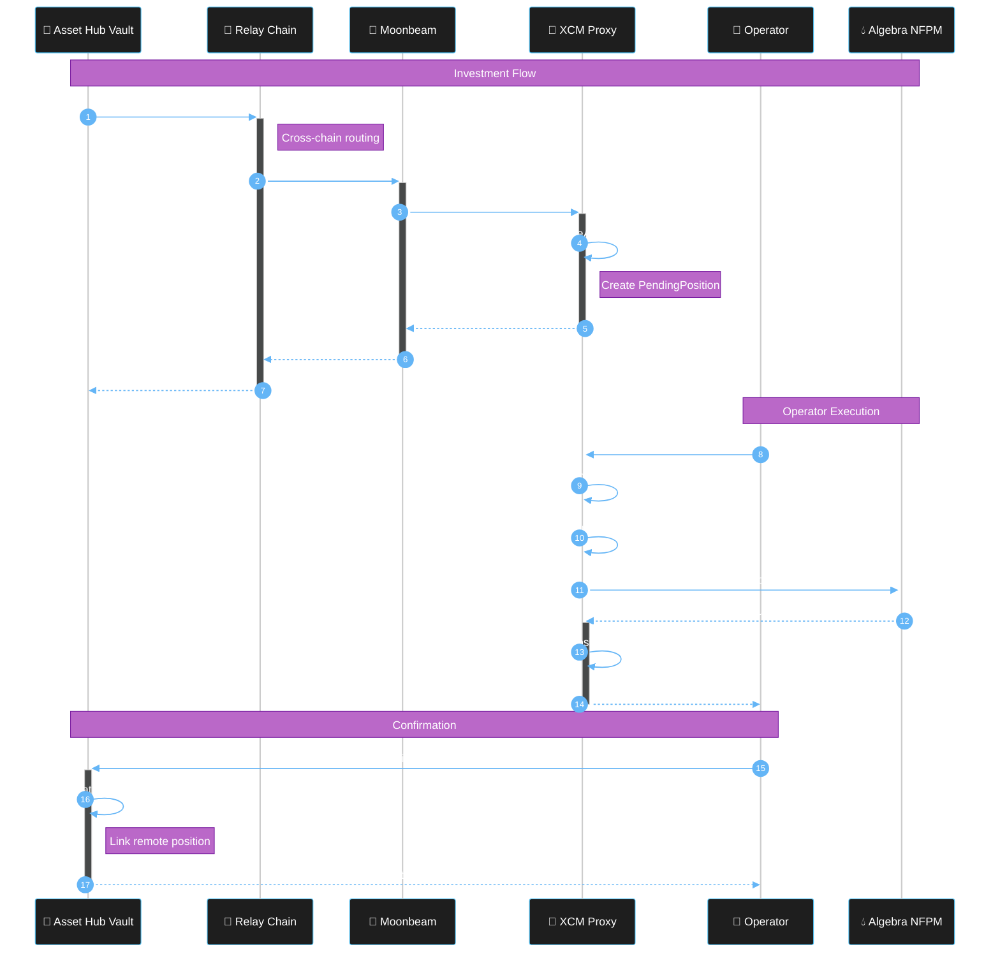

# Cross-Chain Flow

How LiquiDOT uses Polkadot's XCM (Cross-Consensus Messaging) for seamless cross-chain liquidity management.

## XCM Overview

XCM is Polkadot's universal messaging format enabling parachains, smart contracts, and pallets to communicate across consensus systems. LiquiDOT uses XCM to transfer assets and instructions between Asset Hub and Moonbeam.

## Investment Flow

### 1. User Initiates Investment

```javascript
await assetHubVault.investInPool(
  chainId: 1284,
  poolId: "0xPoolABC...",
  baseAsset: "DOT",
  amounts: [parseUnits("100", 10)],
  lowerRangePercent: -5,
  upperRangePercent: 10
);
```

**Vault Actions:**
1. Verify balance
2. Lock DOT
3. Construct XCM message
4. Dispatch to Moonbeam

### 2. XCM Message Transit & Execution Flow



### 3. Asset Reception

**XCM Proxy `receiveAssets()` creates pending position:**
- Receives 99.99 DOT (after XCM fees ~0.01 DOT)
- Stores investment parameters
- Emits `PendingPositionCreated` event
- Position awaits operator execution

### 4. Investment Execution

**Operator calls `executePendingInvestment()`:**
1. Decode pending position parameters
2. Swap tokens to LP pair ratio if needed
3. Calculate tick range from percentages
4. Approve tokens and mint NFPM position
5. Create local position record
6. Delete pending position

### 5. Execution Confirmation

**Operator confirms on Asset Hub:**
```javascript
// Call confirmExecution on AssetHubVault
await assetHubVault.confirmExecution(
  positionId,        // Asset Hub position ID
  remotePositionId,  // Local XCMProxy position ID
  liquidity          // Liquidity created
);
```

**Updates position status:**
- `PendingExecution` → `Active`
- Links Asset Hub position to remote position
- Emits `PositionExecutionConfirmed` event

### 6. Position Monitoring

**Stop-Loss Worker (every 12 seconds):**

```javascript
async function monitorPositions() {
  const positions = await xcmProxy.getActivePositions();
  
  for (const position of positions) {
    const currentPrice = await getPoolPrice(position.pool);
    const lowerBound = position.entryPrice * (1 + position.lowerRangePercent / 100);
    const upperBound = position.entryPrice * (1 + position.upperRangePercent / 100);
    
    if (currentPrice < lowerBound) {
      await triggerLiquidation(position.id, 'STOP_LOSS');
    } else if (currentPrice > upperBound) {
      await triggerLiquidation(position.id, 'TAKE_PROFIT');
    }
  }
}
```

### 7. Liquidation & Return

**Operator calls `liquidateSwapAndReturn()`:**
1. Burn NFPM position and collect fees
2. Swap all tokens to base asset
3. Send assets back via XCM (if not test mode)
4. Emit `LiquidationCompleted` event

### 8. Liquidation Settlement

**Operator settles on Asset Hub:**
```javascript
// After XCM transfer completes
await assetHubVault.settleLiquidation(
  positionId,
  receivedAmount
);
```

**Updates:**
1. Verify contract received assets
2. Update position status to `Liquidated`
3. Credit user balance
4. Emit `LiquidationSettled` event

## XCM Fee Handling

| Direction | Initial | Fee | Received |
|-----------|---------|-----|----------|
| **Outbound** (Asset Hub → Moonbeam) | 100 DOT | ~0.01 DOT | 99.99 DOT |
| **Inbound** (Moonbeam → Asset Hub) | 105 DOT | ~0.01 DOT | 104.99 DOT |

## Error Handling

| Error | Cause | Solution |
|-------|-------|----------|
| BuyExecution failed | Insufficient fees | Increase fee reserve |
| Transact failed | Position exists | Retry with new ID |
| Asset trapped | Reception failed | Call `claimAssets()` |

**Recovery mechanism:**
```solidity
function rescueTrappedAssets(address token, address recipient, uint256 amount) external onlyAdmin {
    IXcmTransactor(XCM_PRECOMPILE).claimAssets(token, amount, recipient);
}
```

## Message Tracking

```javascript
// Get message hash
const messageHash = await assetHubVault.lastXcmMessageHash();

// Query status
const status = await polkadotApi.query.xcmPallet.queries(messageHash);
// Values: Pending, Success, Failed

// Listen for events
assetHubVault.on('XcmMessageSent', (hash, dest) => {
  console.log(`XCM sent: ${hash} → ${dest}`);
});
```

**Next:** [Architecture](architecture.md) • [Smart Contracts](smart-contracts.md) • [Testing Guide](testing-guide.md)
