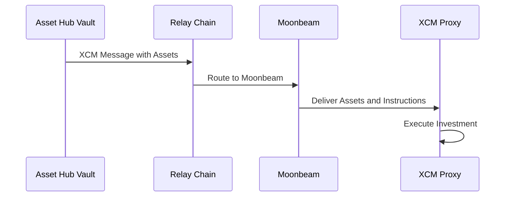

# Cross-Chain Flow

Understanding how LiquiDOT uses Polkadot's XCM (Cross-Consensus Messaging) to enable seamless cross-chain liquidity management.

## What is XCM?

XCM (Cross-Consensus Messaging) is Polkadot's universal messaging format that enables parachains, smart contracts, and pallets to communicate across different consensus systems. LiquiDOT leverages XCM to transfer assets and instructions between Asset Hub and Moonbeam.

## XCM Message Structure

LiquiDOT uses XCM to send both assets and investment instructions in a single atomic message:

```
XCM Message {
  ReserveAssetDeposited: {
    assets: [DOT: 100],
    origin: AssetHub
  },
  BuyExecution: {
    fees: 0.01 DOT
  },
  DepositAsset: {
    assets: [DOT: 99.99],
    beneficiary: XCMProxyContract
  },
  Transact: {
    call: executeInvestment(
      baseAsset: DOT,
      amounts: [100e18],
      poolId: 0xPool...,
      lowerRange: -5%,
      upperRange: +10%,
      owner: 0xUser...
    )
  }
}
```

## Investment Flow (Detailed)

### Step 1: User Initiates Investment

**Location:** Frontend → Asset Hub Vault

```javascript
// User calls via frontend
await assetHubVault.investInPool(
  chainId: 1284,        // Moonbeam
  poolId: "0xPoolABC...",
  baseAsset: "DOT",
  amounts: [parseUnits("100", 10)],  // 100 DOT
  lowerRangePercent: -5,  // 5% downside protection
  upperRangePercent: 10   // 10% upside capture
);
```

**Contract Actions:**
1. Verify user has sufficient balance
2. Lock 100 DOT from user's account
3. Construct XCM message with investment parameters
4. Dispatch XCM message to Moonbeam

### Step 2: XCM Message Transit

**Route:** Asset Hub → Relay Chain → Moonbeam



**XCM Message Contents:**
* **Assets:** 100 DOT (minus XCM fees)
* **Beneficiary:** XCM Proxy contract address
* **Instruction:** Call `receiveAssets()` with investment parameters
* **Callback:** Return address for liquidation proceeds

### Step 3: Asset Reception on Moonbeam

**Location:** XCM Proxy Contract (Moonbeam)

```solidity
function receiveAssets(
    address token,
    address user,
    uint256 amount,
    bytes calldata investmentParams
) external onlyOwner {
    // Decode investment parameters
    InvestmentParams memory params = abi.decode(
        investmentParams,
        (InvestmentParams)
    );
    
    // Execute investment
    executeInvestment(
        params.baseAsset,
        params.amounts,
        params.poolId,
        params.lowerRangePercent,
        params.upperRangePercent,
        user
    );
}
```

**Actions:**
1. Receive 99.99 DOT (after XCM fees)
2. Decode investment instructions from calldata
3. Validate parameters
4. Proceed to investment execution

### Step 4: Investment Execution

**Location:** XCM Proxy Contract (Moonbeam)

```solidity
function executeInvestment(...) internal {
    // 1. Get pool and tokens
    IAlgebraPool pool = IAlgebraPool(poolId);
    address token0 = pool.token0();
    address token1 = pool.token1();
    
    // 2. Determine if swap needed
    if (baseAsset != token0 && baseAsset != token1) {
        revert("Base asset not in pool");
    }
    
    // 3. Calculate optimal amounts
    (uint256 amount0Desired, uint256 amount1Desired) = 
        calculateOptimalAmounts(pool, baseAsset, amounts);
    
    // 4. Execute swap if needed (e.g., DOT → 50% DOT, 50% USDC)
    if (amount1Desired > 0 && baseAsset == token0) {
        swapExactInputSingle(
            token0,
            token1,
            address(this),
            amounts[0] / 2,
            amount1Desired * 95 / 100, // 5% slippage
            0
        );
    }
    
    // 5. Calculate tick range from percentages
    (int24 bottomTick, int24 topTick) = calculateTickRange(
        pool,
        lowerRangePercent,  // -5%
        upperRangePercent   // +10%
    );
    
    // 6. Mint LP position
    (uint128 liquidity, uint256 amount0, uint256 amount1) = 
        pool.mint(
            address(this),
            bottomTick,
            topTick,
            liquidityDesired,
            abi.encode(user)
        );
    
    // 7. Record position
    positions[positionHash] = Position({
        pool: poolId,
        owner: user,
        liquidity: liquidity,
        bottomTick: bottomTick,
        topTick: topTick,
        lowerRangePercent: lowerRangePercent,
        upperRangePercent: upperRangePercent,
        entryPrice: getCurrentPrice(pool),
        token0: token0,
        token1: token1,
        amount0: amount0,
        amount1: amount1,
        timestamp: block.timestamp
    });
}
```

### Step 5: Position Monitoring

**Location:** Stop-Loss Worker (Backend)

```javascript
// Worker runs every 12 seconds
async function monitorPositions() {
  // Get all active positions
  const positions = await xcmProxy.getActivePositions();
  
  for (const position of positions) {
    // Get current pool price
    const currentPrice = await getPoolPrice(position.pool);
    
    // Calculate range boundaries
    const lowerBound = position.entryPrice * (1 + position.lowerRangePercent / 100);
    const upperBound = position.entryPrice * (1 + position.upperRangePercent / 100);
    
    // Check if out of range
    if (currentPrice < lowerBound) {
      console.log(`Stop-loss triggered for position ${position.id}`);
      await triggerLiquidation(position.id, 'STOP_LOSS');
    } else if (currentPrice > upperBound) {
      console.log(`Take-profit triggered for position ${position.id}`);
      await triggerLiquidation(position.id, 'TAKE_PROFIT');
    }
  }
}
```

### Step 6: Liquidation Trigger

**Location:** XCM Proxy Contract (Moonbeam)

```solidity
function executeFullLiquidation(
    bytes32 positionId,
    LiquidationType liquidationType
) external {
    Position storage position = positions[positionId];
    
    // 1. Validate liquidation is authorized
    if (liquidationType == LiquidationType.STOP_LOSS) {
        require(isPositionOutOfRange(positionId), "Position still in range");
    }
    
    // 2. Burn LP position
    (uint256 amount0, uint256 amount1) = executeBurn(
        position.pool,
        position.bottomTick,
        position.topTick,
        position.liquidity
    );
    
    // 3. Collect fees
    position.pool.collect(
        address(this),
        position.bottomTick,
        position.topTick,
        type(uint128).max,
        type(uint128).max
    );
    
    // 4. Swap both tokens to base asset
    uint256 totalBaseAsset = swapToBaseAsset(
        amount0,
        amount1,
        position.baseAsset
    );
    
    // 5. Prepare return via XCM
    returnAssetsToAssetHub(
        position.owner,
        position.baseAsset,
        totalBaseAsset
    );
}
```

### Step 7: Return Assets via XCM

**Location:** XCM Proxy → Asset Hub

```solidity
function returnAssetsToAssetHub(
    address user,
    address token,
    uint256 amount
) internal {
    // Construct XCM message to return funds
    bytes memory xcmMessage = abi.encode(
        XCMInstruction.WithdrawAsset(token, amount),
        XCMInstruction.DepositReserveAsset(
            assets: [token: amount],
            destination: AssetHub,
            xcm: [
                XCMInstruction.BuyExecution(0.01 token),
                XCMInstruction.DepositAsset(
                    assets: [token: amount - 0.01],
                    beneficiary: AssetHubVaultContract
                ),
                XCMInstruction.Transact(
                    call: receiveProceeds(
                        chainId: 1284,
                        positionId: positionHash,
                        finalAmounts: [amount]
                    )
                )
            ]
        )
    );
    
    // Send XCM message
    IXcmTransactor(XCM_PRECOMPILE).sendXcm(
        destinationChain,
        xcmMessage
    );
}
```

### Step 8: Proceeds Reception on Asset Hub

**Location:** Asset Hub Vault Contract

```solidity
function receiveProceeds(
    uint256 chainId,
    bytes32 positionId,
    uint256[] calldata finalAmounts
) external onlyXCMProxy {
    Position storage position = positions[positionId];
    
    // 1. Validate position exists
    require(position.status == PositionStatus.ACTIVE, "Invalid position");
    
    // 2. Calculate profit/loss
    uint256 initialValue = position.initialAmount;
    uint256 finalValue = finalAmounts[0];
    int256 profitLoss = int256(finalValue) - int256(initialValue);
    
    // 3. Credit user balance
    balances[position.owner][position.baseAsset] += finalValue;
    
    // 4. Update position status
    position.status = PositionStatus.CLOSED;
    position.closedAt = block.timestamp;
    position.profitLoss = profitLoss;
    
    // 5. Emit event
    emit ProceedsReceived(
        position.owner,
        positionId,
        chainId,
        finalAmounts,
        profitLoss,
        block.timestamp
    );
}
```

## XCM Fee Handling

### Fee Payment

XCM fees are paid from the transferred assets:

1. **Outbound (Asset Hub → Moonbeam):**
   - User deposits 100 DOT
   - ~0.01 DOT reserved for XCM fees
   - 99.99 DOT reaches Moonbeam

2. **Inbound (Moonbeam → Asset Hub):**
   - Liquidation yields 105 DOT
   - ~0.01 DOT reserved for XCM fees
   - 104.99 DOT reaches Asset Hub

### Fee Estimation

```javascript
// Estimate XCM fees before sending
const fees = await estimateXcmFees({
  origin: 'AssetHub',
  destination: 'Moonbeam',
  asset: 'DOT',
  amount: parseUnits('100', 10)
});

console.log(`XCM fee: ${formatUnits(fees, 10)} DOT`);
// Output: XCM fee: 0.01 DOT
```

## Error Handling

### XCM Message Failures

**Scenario 1: Insufficient Fees**
```
Error: XCM execution failed - BuyExecution failed
Solution: Increase fee reserve in message
```

**Scenario 2: Target Contract Revert**
```
Error: Transact failed - Position already exists
Solution: Retry with new position ID
```

**Scenario 3: Asset Not Received**
```
Error: ReserveAssetDeposited failed - Asset trapped
Solution: Retrieve via xcmTransactor.claimAssets()
```

### Recovery Mechanisms

```solidity
// Emergency asset recovery on Moonbeam
function rescueTrappedAssets(
    address token,
    address recipient,
    uint256 amount
) external onlyAdmin {
    // Claim trapped XCM assets
    IXcmTransactor(XCM_PRECOMPILE).claimAssets(
        token,
        amount,
        recipient
    );
}
```

## XCM Message Tracking

### Track Message Status

```javascript
// Get XCM message hash
const messageHash = await assetHubVault.lastXcmMessageHash();

// Query message status
const status = await polkadotApi.query.xcmPallet.queries(messageHash);

console.log(`Status: ${status.toString()}`);
// Possible values: Pending, Success, Failed
```

### Event Monitoring

```javascript
// Listen for XCM events
assetHubVault.on('XcmMessageSent', (messageHash, destination) => {
  console.log(`XCM sent: ${messageHash} → ${destination}`);
});

xcmProxy.on('XcmMessageReceived', (messageHash, origin) => {
  console.log(`XCM received: ${messageHash} from ${origin}`);
});
```

## Best Practices

### Message Construction
✅ **DO:**
* Include sufficient fees for execution
* Validate parameters before sending
* Implement timeout handling
* Log all XCM messages for tracking

❌ **DON'T:**
* Send messages without fee estimation
* Assume instant delivery
* Ignore XCM events
* Skip error handling

### Gas Optimization
* Batch multiple operations in single XCM message
* Use optimal fee amounts (not too high or low)
* Cache frequently accessed data on both chains
* Minimize cross-chain calls

## Security Considerations

### XCM-Specific Risks
* **Message Interception** - Validate message origin
* **Replay Attacks** - Use nonces and timestamps
* **Fee Exhaustion** - Cap maximum fees
* **Asset Trapping** - Implement recovery mechanisms

### Mitigation Strategies
```solidity
// Validate XCM message origin
modifier onlyFromAssetHub() {
    require(
        msg.sender == XCM_PRECOMPILE,
        "Not from XCM"
    );
    require(
        getXcmOrigin() == ASSETHUB_PARACHAIN_ID,
        "Not from Asset Hub"
    );
    _;
}
```

## Future Enhancements

### Planned XCM Features
* **Multi-hop routing** - Route through multiple parachains
* **Asset conversion** - Automatic asset swaps during transit
* **Batched operations** - Multiple investments in one message
* **XCM v4 features** - Enhanced message types and capabilities

## Next Steps

* [Architecture](architecture.md) - Full system design
* [Smart Contracts](smart-contracts.md) - Contract implementation
* [Testing Guide](testing-guide.md) - XCM testing strategies
