# Smart Contracts

LiquiDOT uses two production-focused contracts that coordinate via XCM to create and manage liquidity positions across chains. This section documents only what’s implemented today.

## Contract Overview

### Deployed Contracts

| Contract          | Chain     | Network        | Address                                      |
| ----------------- | --------- | -------------- | -------------------------------------------- |
| **AssetHubVault** | Asset Hub | Paseo Testnet  | `0x68e86F267C5C37dd4947ef8e5823eBAeAf93Fde6` |
| **XCMProxy**      | Moonbeam  | Moonbase Alpha | `0xe07d18eC747707f29cd3272d48CF84A383647dA1` |

### Contract Roles

| Contract          | Purpose                 | Responsibilities                                                                                                                               |
| ----------------- | ----------------------- | ---------------------------------------------------------------------------------------------------------------------------------------------- |
| **AssetHubVault** | Custody & Orchestration | <p>• Holds user balances securely<br>• Initiates cross-chain investments<br>• Settles liquidation proceeds<br>• Manages position lifecycle</p> |
| **XCMProxy**      | Execution Engine        | <p>• Receives assets via XCM<br>• Executes DEX operations<br>• Manages LP positions<br>• Returns proceeds to Asset Hub</p>                     |

### Source Code

* **AssetHubVault**: [`SmartContracts/contracts/V1(Current)/AssetHubVault.sol`](../../SmartContracts/contracts/V1\(Current\)/AssetHubVault.sol)
* **XCMProxy**: [`SmartContracts/contracts/V1(Current)/XCMProxy.sol`](../../SmartContracts/contracts/V1\(Current\)/XCMProxy.sol)

***

## AssetHubVault

**Location:** Asset Hub (Paseo Testnet)\
**Address:** `0x68e86F267C5C37dd4947ef8e5823eBAeAf93Fde6`

### Overview

Primary custody layer and orchestrator on Asset Hub. Holds user balances, starts cross-chain investments, confirms execution, and settles liquidations. Uses the IXcm precompile at `0x00000000000000000000000000000000000a0000`.

### XCM Interface

The contract uses the official Polkadot XCM precompile:

```solidity
interface IXcm {
    struct Weight {
        uint64 refTime;
        uint64 proofSize;
    }
    function execute(bytes calldata message, Weight calldata maxWeight) external;
    function send(bytes calldata dest, bytes calldata message) external;
    function weighMessage(bytes calldata message) external view returns (Weight memory);
}
```

### Access Roles

| Role          | Permissions                         | Purpose                                          |
| ------------- | ----------------------------------- | ------------------------------------------------ |
| **Admin**     | Configuration & pausing             | System configuration and emergency controls      |
| **Operator**  | Dispatch operations & confirmations | Execute investment flows and settle liquidations |
| **Emergency** | Emergency liquidation               | Force liquidate positions in critical situations |

| Variable                    | Type                           | Description                                                                                                     |
| --------------------------- | ------------------------------ | --------------------------------------------------------------------------------------------------------------- |
| `userBalances`              | `mapping(address => uint256)`  | ETH/native balance per user                                                                                     |
| `positions`                 | `mapping(bytes32 => Position)` | Position details: user, poolId, baseAsset, chainId, range percents, status, amount, remotePositionId, timestamp |
| `userPositions`             | `mapping(address => bytes32[])` | User's position IDs for pagination                                                                             |
| `supportedChains`           | `mapping(uint32 => ChainConfig)` | Registered chains: supported flag, xcmDestination, chainName, timestamp                                       |
| `chainExecutors`            | `mapping(uint32 => address)`   | Authorized remote executor per chain (optional)                                                                 |
| `trustedSettlementCaller`   | `address`                      | XCM-derived origin for production settlements                                                                   |
| `testMode`                  | `bool`                         | Skips actual XCM send for local testing                                                                         |

**User Operations:**

* `Deposit(address indexed user, uint256 amount)`
* `Withdrawal(address indexed user, uint256 amount)`

**Investment Lifecycle:**

* `InvestmentInitiated(bytes32 indexed positionId, address indexed user, uint32 chainId, address poolId, uint256 amount)`
* `PositionExecutionConfirmed(bytes32 indexed positionId, uint32 chainId, bytes32 remotePositionId, uint128 liquidity)`
* `LiquidationSettled(bytes32 indexed positionId, address indexed user, uint256 receivedAmount, uint256 expectedAmount)`
* `PositionLiquidated(bytes32 indexed positionId, address indexed user, uint256 finalAmount)`

**Chain Management:**

* `ChainAdded(uint32 indexed chainId, bytes xcmDestination, address executor)`
* `ChainRemoved(uint32 indexed chainId)`
* `ExecutorUpdated(uint32 indexed chainId, address executor)`

**XCM Operations:**

* `XCMMessageSent(bytes32 indexed messageHash, bytes destination, bytes message)`
* `XcmSendAttempt(bytes32 indexed messageHash, bytes destination, bool success, bytes errorData)`

### Custom Errors

```solidity
// Access Control
NotAdmin(), NotOperator(), NotEmergency()

// State Validation
Paused(), ZeroAddress(), AmountZero()
InsufficientBalance(), InvalidRange()

// XCM & Chain
XcmPrecompileNotSet(), ChainNotSupported()
ChainIdMismatch(), ExecutorNotAuthorized()
UnauthorizedXcmCall(), PositionNotActive()
AmountMismatch(), AssetMismatch()
```

***

## XCMProxy

**Location:** Moonbeam (Moonbase Alpha)\
**Address:** `0xe07d18eC747707f29cd3272d48CF84A383647dA1`

### Overview

Execution engine on Moonbeam. Receives assets and instructions via XCM, performs swaps and LP mint/burn with Algebra's NFPM, tracks positions, and returns proceeds to Asset Hub. Uses the IXTokens precompile at `0x0000000000000000000000000000000000000804` for cross-chain transfers.

### XCM Interface (Moonbeam)

```solidity
// IXTokens precompile for cross-chain transfers
interface IXTokens {
    function transfer(
        address currencyAddress,
        uint256 amount,
        Multilocation memory destination,
        uint64 weight
    ) external;
}
```

### Custom Errors

```solidity
// Access Control
NotOwner(), NotOperator()

// Token & Balance
TokenNotSupported(), InsufficientBalance()

// Position State
PositionNotFound(), PositionNotActive()

// Configuration
InvalidSlippage(), XcmConfigFrozen()
DEXNotConfigured(), NFPMNotSet()
```

### Access Roles

| Role         | Permissions                        | Purpose                                             |
| ------------ | ---------------------------------- | --------------------------------------------------- |
| **Owner**    | Configuration & admin              | Set integrations, XCM config, and system parameters |
| **Operator** | Investment & liquidation execution | Execute pending investments and liquidate positions |

| Variable                    | Type                                  | Description                                                                                                  |
| --------------------------- | ------------------------------------- | ------------------------------------------------------------------------------------------------------------ |
| `supportedTokens`           | `mapping(address => bool)`            | Allowlist for inbound assets                                                                                 |
| `pendingPositions`          | `mapping(bytes32 => PendingPosition)` | Positions awaiting execution (keyed by Asset Hub position ID)                                                |
| `positions`                 | `mapping(uint256 => Position)`        | Active positions: owner, pool, tokens, ticks, liquidity, NFPM tokenId, ranges, entryPrice, timestamp, status |
| `assetHubPositionToLocalId` | `mapping(bytes32 => uint256)`         | Maps Asset Hub position ID to local position ID                                                              |
| `quoterContract`            | `address`                             | Algebra Quoter for price quotes                                                                              |
| `swapRouterContract`        | `address`                             | Algebra SwapRouter for token swaps                                                                           |
| `nfpmContract`              | `address`                             | Algebra NFPM for LP position management                                                                      |
| `xTokensPrecompile`         | `address`                             | XTokens precompile for cross-chain transfers                                                                 |
| `xcmTransactorPrecompile`   | `address`                             | XCM Transactor for remote calls                                                                              |
| `defaultDestWeight`         | `uint64`                              | Default XCM destination weight                                                                               |
| `assetHubParaId`            | `uint32`                              | Asset Hub parachain ID                                                                                       |
| `trustedXcmCaller`          | `address`                             | Authorized XCM message sender                                                                                |
| `xcmConfigFrozen`           | `bool`                                | Freeze flag to prevent further XCM config changes                                                            |
| `defaultSlippageBps`        | `uint16`                              | Default slippage tolerance (basis points)                                                                    |
| `testMode`                  | `bool`                                | Skip XCM sends for local testing                                                                             |

### Events

* AssetsReceived, PendingPositionCreated, PositionExecuted, PositionCreated, LiquidityAdded
* PositionLiquidated, LiquidationCompleted, PendingPositionCancelled
* AssetsReturned, ProceedsSwapped
* Config events: XTokensPrecompileSet, DefaultDestWeightSet, AssetHubParaIdSet, TrustedXcmCallerSet, XcmConfigFrozen, XcmTransactorPrecompileSet, DefaultSlippageSet, OperatorUpdated

```solidity
// DEX Integration
function setIntegrations(address quoter, address router) external onlyOwner
function setNFPM(address nfpm) external onlyOwner

// XCM Configuration
function setXTokensPrecompile(address xTokens) external onlyOwner
function setDefaultDestWeight(uint64 weight) external onlyOwner
function setAssetHubParaId(uint32 paraId) external onlyOwner
function setTrustedXcmCaller(address caller) external onlyOwner
function freezeXcmConfig() external onlyOwner
function setXcmTransactorPrecompile(address xcmTransactor) external onlyOwner

// System Settings
function setDefaultSlippageBps(uint16 slippageBps) external onlyOwner
function setOperator(address newOperator) external onlyOwner
function setTestMode(bool enabled) external onlyOwner

// Token Management
function addSupportedToken(address token) external onlyOwner
function removeSupportedToken(address token) external onlyOwner

// Emergency Controls
function pause() external onlyOwner
function unpause() external onlyOwner
```

#### XCM & Execution Functions

```solidity
// Receive assets and create pending position (called via XCM Transact)
function receiveAssets(
    bytes32 assetHubPositionId,
    address token,
    address user,
    uint256 amount,
    bytes memory investmentParams
) external

// Execute pending investment
function executePendingInvestment(
    bytes32 assetHubPositionId
) external onlyOperator returns (uint256 localPositionId)

// Cancel pending position and return funds
function cancelPendingPosition(
    bytes32 assetHubPositionId,
    bytes calldata destination
) external onlyOperator

// Full liquidation (burn LP, collect fees)
function executeFullLiquidation(
    uint256 positionId
) external onlyOperator returns (uint256 amount0, uint256 amount1)

// Atomic check + liquidate if out of range
function liquidateIfOutOfRange(
    uint256 positionId
) external onlyOperator returns (bool liquidated, uint256 amount0, uint256 amount1)

// Liquidate, swap to base asset, and return via XCM
function liquidateSwapAndReturn(
    uint256 positionId,
    address baseAsset,
    uint256 minAmountOut,
    bytes calldata destination,
    bytes32 assetHubPositionId
) external onlyOperator

// Return assets to Asset Hub
function returnAssets(
    address token,
    address user,
    uint256 amount,
    bytes calldata destination
) external onlyOwner
```

#### Query & Helper Functions

```solidity
// Calculate tick range from percentage ranges
function calculateTickRange(
    int24 lowerRangePercent,
    int24 upperRangePercent
) public view returns (int24 bottomTick, int24 topTick)

// Check if position is out of range
function isPositionOutOfRange(
    uint256 positionId
) public view returns (bool outOfRange, uint256 currentPrice)

// Collect accumulated fees
function collectFees(
    uint256 positionId
) external returns (uint256 amount0, uint256 amount1)

// Execute swap
function swapExactInputSingle(
    address tokenIn,
    address tokenOut,
    address recipient,
    uint256 amountIn,
    uint256 amountOutMinimum,
    uint160 limitSqrtPrice
) external onlyOwner returns (uint256 amountOut)

// Get swap quote
function quoteExactInputSingle(
    address tokenIn,
    address tokenOut,
    uint256 amountIn,
    uint160 limitSqrtPrice
) external returns (uint256 amountOut)

// Get all active positions
function getActivePositions() external view returns (Position[] memory)

// Get user's positions
function getUserPositions(address user) external view returns (uint256[] memory)
```

#### XCM Configuration (Owner)

```solidity
// XCM precompile configuration
function setXTokensPrecompile(address precompile) external onlyOwner
function setXcmTransactorPrecompile(address precompile) external onlyOwner
function setDefaultDestWeight(uint64 weight) external onlyOwner
function setAssetHubParaId(uint32 paraId) external onlyOwner
function setTrustedXcmCaller(address caller) external onlyOwner
function freezeXcmConfig() external onlyOwner

// DEX integration
function setIntegrations(address quoter, address router) external onlyOwner
function setNFPM(address nfpm) external onlyOwner

// System settings
function setDefaultSlippageBps(uint16 bps) external onlyOwner
function setOperator(address newOperator) external onlyOwner
function setTestMode(bool enabled) external onlyOwner
```

***

## Contract Flows

### Investment Flow


### Liquidation Flow

```mermaid
%%{init: {'theme':'dark', 'themeVariables': { 'fontSize':'16px'}}}%%
sequenceDiagram
    autonumber
    participant Monitor as ⚡ Stop-Loss Worker
    participant Proxy as 🌙 XCMProxy
    participant DEX as 💧 Algebra NFPM
    participant XCM as 🔗 XCM Layer
    participant AVault as 💎 AssetHubVault
    participant User
    
    Monitor->>+Proxy: Trigger liquidation
    Note over Monitor: Out of range detected
    
    Proxy->>+Proxy: executeFullLiquidation()
    Proxy->>+DEX: Burn LP position
    DEX-->>-Proxy: Token0, Token1, fees
    
    Proxy->>Proxy: Swap to base asset
    Note over Proxy: Convert all to DOT
    
    Proxy->>+XCM: returnAssets()
    XCM->>+AVault: Transfer proceeds
    Note over AVault: Assets received
    AVault->>AVault: settleLiquidation()
    AVault->>AVault: Credit user balance
    AVault-->>-User: Proceeds available
    
    Proxy-->>+XCM: Return complete
    XCM-->>-Monitor: Liquidation confirmed
```



***

## Current Design Notes

### DEX Target: StellaSwap Pulsar (Algebra Integral)

The XCMProxy contract uses `@cryptoalgebra/integral-*` interfaces which include the `deployer` field in mint/swap parameters.

**✅ StellaSwap Compatibility:** StellaSwap on Moonbeam mainnet uses Algebra Integral v1.2 ([stellaswap/Integral-contracts](https://github.com/stellaswap/Integral-contracts), forked from cryptoalgebra/Algebra). The interfaces are **fully compatible** - StellaSwap includes the `deployer` field.

**Deployment Strategy:**
- **Testnet (Moonbase Alpha):** Our own Algebra Integral deployment (see `SmartContracts/deployments/moonbase_bootstrap.json`)
- **Mainnet (Moonbeam):** StellaSwap Pulsar contracts - no interface changes needed

### Single-Sided vs Dual-Sided Liquidity

When minting LP positions, the `amounts` array must be populated based on the current pool price relative to the tick range:

| Pool Price vs Range | Token0 Required | Token1 Required |
|---------------------|-----------------|-----------------|
| Price **below** range | ✅ Yes | ❌ No |
| Price **above** range | ❌ No | ✅ Yes |
| Price **within** range | ✅ Yes | ✅ Yes |

This is standard Uniswap V3/Algebra concentrated liquidity math.

### Operator-Triggered Liquidations

LiquiDOT uses an **operator-triggered liquidation model**, not automated on-chain triggers:

- `isPositionOutOfRange(positionId)` - View function to check status
- `liquidateIfOutOfRange(positionId)` - Atomic check + liquidate (recommended)
- `executeFullLiquidation(positionId)` - Unconditional liquidation

The backend Stop-Loss Worker monitors positions and triggers liquidations based on configurable thresholds.

***

## Additional Resources

### Deployment Information

For complete deployment details including:

* Bootstrap configurations
* DEX integration addresses
* Testnet faucets
* Verification links

See: `SmartContracts/deployments/`

### Testing

Comprehensive test suites available:

* Unit tests: `SmartContracts/test/AssetHubVault/*.test.js`
* Integration tests: `SmartContracts/test/XCMProxy/*.test.js`
* E2E flows: `SmartContracts/test/Integration/*.test.js`

### Related Documentation

* [Contract Deployment Guide](contract-deployment.md) - Step-by-step deployment instructions
* [Testing Guide](testing-guide.md) - How to test the contracts
* [Architecture Overview](architecture.md) - System design and data flow

***

## Notes

This documentation mirrors the current codebase. As features evolve (additional chains, new DEX integrations), this page will be updated to track function signatures and events from the Solidity sources referenced above.

**Last Updated:** January 2026\
**Contract Version:** V1 (Current)
