# How It Works

LiquiDOT automates the entire lifecycle of liquidity provision through a sophisticated cross-chain architecture. Here's how the system operates from deposit to profit.

## The Flow

```mermaid
%%{init: {'theme':'dark', 'themeVariables': { 'primaryColor':'#4fc3f7','primaryTextColor':'#fff','primaryBorderColor':'#0288d1','lineColor':'#64b5f6','secondaryColor':'#ba68c8','tertiaryColor':'#66bb6a','fontSize':'16px'}}}%%
graph TB
    User([👤 User])
    AssetHub[💎 Asset Hub Vault]
    Backend[🤖 Investment Decision Worker]
    PoolData[(📊 Pool Analytics)]
    Moonbeam[🌙 XCM Proxy on Moonbeam]
    DEX[🔄 Algebra DEX]
    Monitor[⚡ Stop-Loss Worker]
    
    User -->|1. Deposits Assets| AssetHub
    User -->|2. Sets Strategy| Backend
    Backend -->|3. Analyzes Markets| PoolData
    Backend -->|4. Triggers Investment| AssetHub
    AssetHub ==>|5. XCM Transfer + Instructions| Moonbeam
    Moonbeam -->|6. Swaps & Mints LP| DEX
    Monitor -.->|7. Monitors 24/7| Moonbeam
    Monitor -.->|8. Detects Trigger| Moonbeam
    Moonbeam -->|9. Burns LP & Swaps| DEX
    Moonbeam ==>|10. Returns Proceeds via XCM| AssetHub
    AssetHub -->|11. Credits Account| User
    
    classDef userStyle fill:#4fc3f7,stroke:#0288d1,stroke-width:3px,color:#000
    classDef vaultStyle fill:#66bb6a,stroke:#388e3c,stroke-width:3px,color:#fff
    classDef backendStyle fill:#ba68c8,stroke:#7b1fa2,stroke-width:3px,color:#fff
    classDef moonbeamStyle fill:#64b5f6,stroke:#1976d2,stroke-width:3px,color:#fff
    classDef dexStyle fill:#f06292,stroke:#c2185b,stroke-width:3px,color:#fff
    
    class User userStyle
    class AssetHub vaultStyle
    class Backend,PoolData,Monitor backendStyle
    class Moonbeam moonbeamStyle
    class DEX dexStyle
```

## The Process Step by Step

### 1. User Deposits Assets

Users deposit their assets (DOT) into the **Asset Hub Vault Contract**. This contract acts as the secure custody layer, maintaining precise accounting of all user balances.

**Why Asset Hub?**
* Maximum security through battle-tested vault patterns
* Native XCM integration for cross-chain operations
* Single source of truth for user funds

### 2. Strategy Configuration

Users configure their investment preferences:

* **Risk Profile** - Conservative, Moderate, or Aggressive
* **Asset Preferences** - Which tokens they want exposure to
* **Risk Thresholds** - Stop-loss and take-profit percentages
* **Allocation Limits** - Maximum per-pool investment
* **Minimum APY** - Target returns

### 3. Market Analysis

The **Investment Decision Worker** continuously:

* Monitors liquidity pools across supported DEXes
* Analyzes 24hr volume, TVL, and fee generation
* Evaluates historical performance data
* Calculates risk-adjusted returns
* Matches opportunities to user strategies

### 4. Investment Execution

When an optimal opportunity is found:

1. The worker calls `investInPool()` on the Asset Hub Vault
2. The vault transfers assets + instructions via XCM to Moonbeam
3. The **XCM Proxy Contract** receives both assets and investment parameters

### 5. Liquidity Position Creation

The XCM Proxy on Moonbeam:

1. **Swaps tokens if needed** - Converts base asset to LP pair ratio
2. **Calculates tick ranges** - Converts user-friendly percentages (e.g., -5%/+10%) to precise tick boundaries
3. **Mints LP position** - Creates concentrated liquidity position on Algebra DEX
4. **Records position data** - Stores entry price, ranges, and ownership

**Example:** User specifies -5% downside, +10% upside protection
* Current price: $100
* Lower bound: $95 (5% below)
* Upper bound: $110 (10% above)
* System automatically converts to precise ticks

### 6. Position Monitoring

The **Stop-Loss Worker** runs continuously:

* Queries all active positions every block
* Checks current pool prices against user-defined ranges
* Validates position health
* Prepares liquidation when thresholds are breached

**Multiple Liquidation Triggers:**
* Stop-loss hit (price drops X%)
* Take-profit hit (price gains Y%)
* Emergency liquidation (admin override)
* Strategic rebalancing (better opportunity found)

### 7. Automated Liquidation

When a trigger condition is met:

1. Worker calls `executeFullLiquidation()` on XCM Proxy
2. Contract validates position is truly out of range (security check)
3. Burns LP position to reclaim tokens
4. Swaps both tokens back to user's base asset
5. Initiates XCM transfer back to Asset Hub
6. Asset Hub credits user's balance

### 8. Continuous Optimization

The system never sleeps:

* Monitors for better opportunities
* Suggests rebalancing when market conditions change
* Adjusts positions to maintain target risk levels
* Compounds earnings into new positions (optional)

## Key Innovations

### Asymmetric Range Management

Unlike traditional LP tools that use symmetric ranges (±X%), LiquiDOT supports **asymmetric ranges**:

* **Downside protection**: -2% (tight stop-loss)
* **Upside capture**: +15% (wider profit window)

This allows users to express directional views while providing liquidity.

### Cross-Chain Asset Custody

**Why separate custody from execution?**

* **Security** - User funds never leave Asset Hub's secure vault
* **Efficiency** - All DEX operations happen on optimized Moonbeam EVM
* **Flexibility** - Easy to add new parachains without migrating funds
* **Recovery** - Emergency liquidations always return to Asset Hub

### Zero Manual Intervention

Once configured, users can:
* ✅ Set preferences and forget
* ✅ Sleep while positions are monitored 24/7
* ✅ Automatically exit at profit targets
* ✅ Avoid losses with automatic stop-loss
* ✅ Let system find and capture opportunities

## Architecture Benefits

| Feature | Benefit |
|---------|---------|
| **XCM Integration** | Native Polkadot cross-chain messaging |
| **Automated Monitoring** | 24/7 position tracking without manual oversight |
| **Smart Liquidation** | Multi-source triggers with validation |
| **Percentage-Based Ranges** | User-friendly risk parameters |
| **Secure Custody** | Funds remain on Asset Hub |
| **Gas Efficiency** | Optimized Moonbeam execution |

## Next Steps

Ready to dive deeper? Explore:

* [Architecture Details](../basics/architecture.md) - Technical deep-dive
* [Smart Contracts](../basics/smart-contracts.md) - Contract documentation
* [Cross-Chain Flow](../basics/cross-chain-flow.md) - XCM messaging details
* [Contract Deployment](../basics/contract-deployment.md) - Deployment guide
